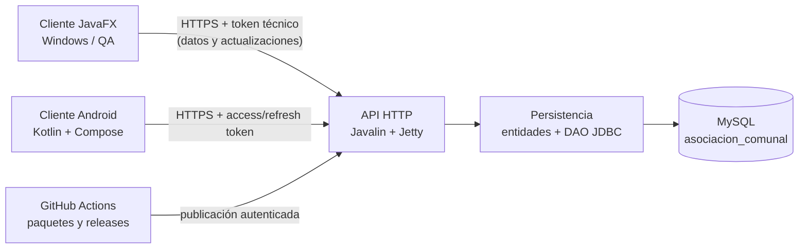

# Asociación Comunal

## Arquitectura del backend y crédito

La API unificada sigue la arquitectura propuesta por Gerson Bermúdez en el PR #24:
`controller -> service -> dao -> domain`, con `config`, `middleware` y `util` como capas transversales.
La integración conserva esa separación y elimina la dependencia del módulo backend anterior.
Los clientes JavaFX usan JWT para las funciones administrativas; Android mantiene sesiones opacas
compatibles; y los canales de publicación de actualizaciones usan un secreto técnico independiente.

Sistema multiplataforma para administrar una asociación comunal. El repositorio contiene una aplicación de escritorio para el personal administrativo, una API HTTP, una biblioteca de persistencia JDBC y una aplicación Android para residentes.

> [!IMPORTANT]
> Este documento describe el estado real del código en agosto de 2026. La autenticación de Android ya utiliza usuarios y sesiones de MySQL; el inicio de sesión del cliente JavaFX todavía utiliza usuarios simulados. Los módulos de miembros, proyectos y viviendas del cliente JavaFX sí consumen la API remota.

## Contenido

- [Funcionalidades](#funcionalidades)
- [Arquitectura](#arquitectura)
- [Tecnologías y versiones](#tecnologías-y-versiones)
- [Estructura del repositorio](#estructura-del-repositorio)
- [Requisitos](#requisitos)
- [Configuración de MySQL](#configuración-de-mysql)
- [Compilación y pruebas](#compilación-y-pruebas)
- [Ejecución de la API](#ejecución-de-la-api)
- [Rutas HTTP disponibles](#rutas-http-disponibles)
- [Ejecución del cliente JavaFX](#ejecución-del-cliente-javafx)
- [Ejecución de Android](#ejecución-de-android)
- [Empaquetado y actualizaciones](#empaquetado-y-actualizaciones)
- [Cómo agregar una función al backend](#cómo-agregar-una-función-al-backend)
- [Seguridad](#seguridad)
- [Solución de problemas](#solución-de-problemas)
- [Documentación adicional](#documentación-adicional)

## Funcionalidades

### Aplicación de escritorio

- Interfaz JavaFX construida con FXML, CSS, AtlantaFX e Ikonli.
- Inicio de sesión local de desarrollo con bloqueo temporal después de cinco intentos fallidos.
- Dashboard y navegación por los módulos administrativos.
- Consulta y registro de miembros mediante la API.
- Consulta de proyectos mediante la API.
- CRUD de viviendas, representante y censo de adultos y menores.
- Tema claro y oscuro.
- Diseño adaptable para diferentes tamaños de ventana.
- Descarga e instalación de actualizaciones incrementales para Windows.
- Creación automática de un acceso directo en el escritorio dentro del paquete QA.

### API y persistencia

- Servidor HTTP embebido con Javalin y Jetty.
- Acceso a MySQL mediante JDBC y sentencias preparadas.
- Entidades y DAOs para miembros, usuarios, roles, cargos, aportaciones, proyectos, votaciones, reuniones, asistencia, bitácora y viviendas.
- Autenticación con access token y refresh token.
- Rotación y revocación de sesiones.
- Contraseñas almacenadas con PBKDF2-HMAC-SHA256.
- Tokens almacenados en MySQL únicamente mediante su hash SHA-256.
- Publicación y distribución de actualizaciones de Windows y Android.
- Endpoint de salud que comprueba la API y la conexión a MySQL.

### Aplicación Android

- Inicio de sesión contra usuarios reales de MySQL.
- Renovación de sesión y cierre de sesión con revocación en el servidor.
- Cambio obligatorio de contraseña temporal.
- Persistencia local de tokens con DataStore y cifrado AES-GCM respaldado por Android Keystore.
- UI declarativa con Jetpack Compose y Material 3.
- Tema claro u oscuro según el sistema.
- Detección, descarga e instalación autorizada de actualizaciones APK.

Los módulos Android de pagos, proyectos, reuniones y votaciones todavía no están implementados.

### Cambio destacado: viviendas y censo familiar

- CRUD de viviendas con código, sector, dirección, referencia y estado.
- Asignación de un miembro activo como representante.
- Registro separado de adultos y menores que habitan la vivienda.
- Vista de detalle con información completa y habitantes.
- Relación de cada miembro con su vivienda mediante `id_vivienda`.
- Búsqueda, conteo de viviendas y resumen de población registrada.

## Arquitectura

El repositorio usa un reactor Maven con tres módulos Java y un proyecto Gradle independiente para Android:



### Responsabilidad de cada módulo

| Módulo | Responsabilidad | Resultado principal |
| --- | --- | --- |
| `backend` | Entidades, configuración de MySQL y DAOs JDBC. No levanta un servidor. | `backend-1.0-SNAPSHOT.jar` |
| `api` | Servidor Javalin, rutas HTTP, autenticación, DTOs y publicación de actualizaciones. Depende de `backend`. | `asociacion-api.jar` ejecutable |
| `frontend` | Cliente administrativo JavaFX, FXML, controladores y clientes HTTP. | JAR y paquete de Windows |
| `android-app` | Cliente Android para residentes. Es independiente del reactor Maven. | APK de depuración o firmado |

El `maven-shade-plugin` crea `api/target/asociacion-api.jar` e incluye las dependencias necesarias, entre ellas el módulo `backend`. Por tanto, el código está separado en módulos, pero el servidor se despliega como un solo JAR ejecutable.

### Capas actuales y arquitectura objetivo

La autenticación ya sigue este flujo:

```text
AuthRoutes -> AuthService -> UserAuthRepository / SessionRepository -> JDBC -> MySQL
```

Algunas rutas de miembros, proyectos y viviendas todavía llaman directamente a los DAOs desde `ApiServer`:

```text
ApiServer -> DAO -> MySQL
```

Toda funcionalidad nueva debe utilizar esta separación:

```text
Controller o Routes -> Service -> Repository o DAO -> MySQL
          |               |
          |               +-- reglas de negocio y transacciones
          +-- DTOs de request/response y contexto HTTP
```

- Los controllers definen método HTTP, ruta, código de estado y serialización.
- Los services contienen validaciones de negocio, autorización, transacciones y coordinación entre repositorios.
- Los repositories o DAOs contienen exclusivamente consultas y persistencia.
- Los DTOs controlan qué datos acepta y devuelve la API.
- Las entidades de persistencia no deben devolverse directamente al cliente.

## Tecnologías y versiones

### Java, API y escritorio

| Tecnología | Versión | Uso |
| --- | ---: | --- |
| Java / JDK | 21 | Backend, API, JavaFX, pruebas y `jpackage` |
| Maven | 3.9.16 local; compatible con 3.9.x | Reactor, dependencias, compilación y pruebas |
| JavaFX | 21.0.2 | Interfaz de escritorio |
| Javalin | 7.2.2 | Framework HTTP de la API |
| Jetty | 12.1.8, resuelta por Javalin | Servidor HTTP embebido |
| Jackson Databind | 2.21.3 | JSON en API y cliente JavaFX |
| MySQL Connector/J | 8.3.0 | Controlador JDBC |
| MySQL | 8.4 documentado | Base de datos InnoDB con `utf8mb4` |
| AtlantaFX | 2.1.0 | Tema visual JavaFX |
| Ikonli | 12.4.0 | Iconos Feather en JavaFX |
| SLF4J Simple | 2.0.17 | Logging de la API |
| JUnit Jupiter | 5.14.2 | Pruebas de API y JavaFX |

### Android

| Tecnología | Versión o nivel | Uso |
| --- | ---: | --- |
| Gradle Wrapper | 8.11.1 | Construcción reproducible |
| Android Gradle Plugin | 8.9.0 | Compilación Android |
| Kotlin | 2.1.10 | Lenguaje del cliente Android |
| JVM target | 17 | Bytecode Java/Kotlin de Android |
| Compile/Target SDK | 35 | API de compilación y destino |
| Min SDK | 23 | Android mínimo compatible |
| Compose BOM | 2025.02.00 | UI declarativa |
| Activity Compose | 1.10.0 | Integración de Activity y Compose |
| Navigation Compose | 2.8.7 | Navegación |
| Lifecycle | 2.8.7 | Estado y ViewModel |
| Retrofit | 2.11.0 | Cliente HTTP tipado |
| OkHttp | 4.12.0 | Transporte HTTP y logging de desarrollo |
| DataStore Preferences | 1.1.2 | Persistencia local de sesión |
| Coroutines Android | 1.10.1 | Operaciones asíncronas |

### Entrega continua

- GitHub Actions para probar, empaquetar y publicar.
- `jpackage` del JDK 21 para crear la imagen ejecutable de Windows.
- ZIP completo para una instalación nueva y ZIP incremental para actualizaciones.
- GitHub Releases para distribuir paquetes verificables.
- SHA-256 para comprobar integridad de ZIP y APK.

## Estructura del repositorio

```text
AsociacionComunal/
├── api/                         servidor Javalin y autenticación
│   ├── src/main/java/
│   ├── src/test/java/
│   └── pom.xml
├── backend/                     entidades, DAOs y conexión JDBC
│   ├── src/main/java/
│   ├── src/test/java/
│   └── pom.xml
├── frontend/                    cliente administrativo JavaFX
│   ├── src/main/java/
│   ├── src/main/resources/      FXML, CSS, imágenes y actualizador
│   ├── src/test/java/
│   └── pom.xml
├── android-app/                 proyecto Android con Gradle Wrapper
├── database/migrations/         migraciones SQL manuales versionadas
├── scripts/                     configuración y empaquetado de QA
├── docs/                        guías especializadas
├── .github/workflows/           CI/CD de Windows y Android
├── database-example.properties  plantilla de conexión MySQL
└── pom.xml                      reactor Maven raíz
```

## Requisitos

### Para backend, API y JavaFX

1. Windows 10/11, Linux o macOS para desarrollo. El paquete QA actual se genera para Windows.
2. JDK 21, no solamente un JRE. Debe incluir `java`, `javac` y `jpackage`.
3. Maven 3.9.x disponible como `mvn`/`mvn.cmd`.
4. Acceso a MySQL 8.x con el esquema `asociacion_comunal`.
5. Git para control de versiones.

Comprobar las herramientas:

```powershell
java -version
javac -version
mvn -version
```

La carpeta local `apache-maven-3.9.16/`, cuando existe, está ignorada por Git y no sustituye un Maven Wrapper. Los comandos de esta guía usan `mvn`; en este equipo también se puede sustituir por:

```powershell
.\apache-maven-3.9.16\bin\mvn.cmd
```

### Para Android

- Android Studio con Android SDK 35.
- JDK 21 para ejecutar Gradle.
- Un emulador o dispositivo con Android 6.0/API 23 o superior.

No es necesario instalar Gradle globalmente: `android-app` incluye Gradle Wrapper.

## Configuración de MySQL

### 1. Crear la configuración local

Desde la raíz del repositorio:

```powershell
Copy-Item .\database-example.properties .\database-local.properties
```

Editar `database-local.properties`:

```properties
db.host=IP_O_NOMBRE_DEL_SERVIDOR
db.port=3306
db.name=asociacion_comunal
db.user=USUARIO_MYSQL
db.password=CONTRASENA_MYSQL
db.parameters=serverTimezone=America/El_Salvador&useUnicode=true&characterEncoding=UTF-8
```

`database-local.properties` está ignorado por Git. Nunca debe subirse al repositorio.

### 2. Variables de entorno admitidas

Las variables de entorno tienen prioridad sobre el archivo local:

| Variable | Obligatoria | Valor predeterminado o función |
| --- | --- | --- |
| `DB_HOST` | No | `localhost` |
| `DB_PORT` | No | `3306` |
| `DB_NAME` | No | `asociacion_comunal` |
| `DB_USER` | Sí, si no está en el archivo | Usuario de aplicación |
| `DB_PASSWORD` | Sí, si no está en el archivo | Contraseña de aplicación |
| `DB_PARAMETERS` | No | Zona horaria y UTF-8 |
| `DB_CONFIG_FILE` | No | Ruta absoluta a otro archivo `.properties` |

La búsqueda automática del archivo se realiza en el directorio actual y en su directorio padre. Para evitar ambigüedad:

```powershell
$env:DB_CONFIG_FILE = (Resolve-Path .\database-local.properties).Path
```

### 3. Preparar el esquema y aplicar migraciones

El repositorio no contiene una migración `V001` que cree las 14 tablas originales. Las migraciones incluidas asumen que el esquema base ya contiene, entre otras, las tablas `usuario` y `miembro`.

Después de respaldar la base, aplicar manualmente y en este orden:

1. `V002__crear_sesion_usuario.sql`: crea sesiones para access/refresh tokens.
2. `V003__forzar_cambio_clave_temporal.sql`: agrega el indicador de cambio obligatorio.
3. `V004__tipo_documento_miembro.sql`: admite DUI, pasaporte y carnet de residente.
4. `V005__crear_viviendas_y_residentes.sql`: crea viviendas, habitantes y relaciones con miembros.

Se pueden abrir y ejecutar los archivos desde MySQL Workbench. Con el cliente `mysql`, desde la raíz y usando `cmd.exe` en Windows:

```powershell
cmd /c "mysql -h HOST -P 3306 -u USUARIO -p asociacion_comunal < database\migrations\V002__crear_sesion_usuario.sql"
```

Repetir el comando para `V003`, `V004` y `V005`. No se utiliza Flyway ni Liquibase actualmente, por lo que el equipo debe registrar qué migraciones fueron aplicadas en cada ambiente.

### 4. Verificar la conexión

Ejecutar la prueba de diagnóstico del módulo unificado `api`:

```powershell
mvn -f .\api\pom.xml -Dtest=DatabaseConnectionTest test
```

La herramienta abre una conexión, muestra la base activa, enumera las tablas y consulta los roles. No inserta, modifica ni elimina datos.

## Compilación y pruebas

### Reactor Maven completo

Desde la raíz:

```powershell
mvn clean test
mvn clean install
```

El orden del reactor es `backend`, `api` y `frontend`. `install` coloca el JAR de `backend` en el repositorio Maven local para que los otros módulos puedan resolverlo cuando se construyen por separado.

### Pruebas por módulo

```powershell
mvn -f .\api\pom.xml test
mvn -f .\frontend\pom.xml test

Set-Location .\android-app
.\gradlew.bat testDebugUnitTest
Set-Location ..
```

Cobertura actual:

- `api`: login, sesiones, expiración, rotación, logout, cambio de contraseña, roles y ausencia del hash de contraseña en respuestas.
- `frontend`: carga de FXML, navegación y manejo local de sesión.
- `android-app`: validación de login y comparación de versiones.
- `backend`: la comprobación de base de datos es una herramienta manual, no una prueba JUnit automática.

Los tests estándar de autenticación de la API usan repositorios en memoria y no requieren MySQL. Las pruebas JavaFX pueden necesitar una sesión gráfica en algunos sistemas.

Las pruebas de navegación JavaFX instancian algunos clientes HTTP. Antes de ejecutarlas debe existir una configuración QA sintácticamente válida mediante variables de entorno o `qa-local.properties`; la prueba no necesita que las consultas remotas finalicen correctamente.

## Ejecución de la API

### 1. Construir el JAR ejecutable

```powershell
mvn -pl api -am clean package
```

Resultado:

```text
api/target/asociacion-api.jar
```

### 2. Configurar el proceso

Además de MySQL, la API requiere un secreto técnico aleatorio de al menos 32 caracteres:

| Variable | Obligatoria | Predeterminado |
| --- | --- | --- |
| `API_SHARED_SECRET` | Sí | Ninguno; mínimo 32 caracteres |
| `API_PORT` | No | `8080`; debe estar entre 1024 y 65535 |
| `AUTH_ACCESS_TTL_MINUTES` | No | `15` |
| `AUTH_REFRESH_TTL_DAYS` | No | `30` |

Ejemplo para la terminal actual de PowerShell:

```powershell
$env:DB_CONFIG_FILE = (Resolve-Path .\database-local.properties).Path
$secretBytes = New-Object byte[] 32
$secretGenerator = [System.Security.Cryptography.RandomNumberGenerator]::Create()
try { $secretGenerator.GetBytes($secretBytes) } finally { $secretGenerator.Dispose() }
$env:API_SHARED_SECRET = -join ($secretBytes | ForEach-Object { $_.ToString("x2") })
$env:API_PORT = "8080"
```

No guardar el secreto real en scripts, documentación, capturas ni commits.

### 3. Iniciar

```powershell
java -jar .\api\target\asociacion-api.jar
```

La API se enlaza intencionalmente a `127.0.0.1`, no a todas las interfaces. Para acceso remoto debe colocarse detrás de un túnel o proxy HTTPS; MySQL no debe exponerse a Internet.

### 4. Comprobar salud y acceso técnico

```powershell
Invoke-RestMethod -Method Get -Uri "http://127.0.0.1:8080/health"

$technicalHeaders = @{ Authorization = "Bearer $env:API_SHARED_SECRET" }
Invoke-RestMethod -Method Get `
  -Uri "http://127.0.0.1:8080/api/miembros" `
  -Headers $technicalHeaders
```

Respuesta esperada de salud cuando MySQL está disponible:

```json
{
  "service": "asociacion-api",
  "database": "available"
}
```

## Rutas HTTP disponibles

### Autenticación de usuarios

| Método | Ruta | Autenticación | Función |
| --- | --- | --- | --- |
| `POST` | `/api/auth/login` | Pública | Valida usuario/contraseña y crea una sesión. |
| `POST` | `/api/auth/refresh` | Refresh token en JSON | Rota access y refresh token. |
| `POST` | `/api/auth/logout` | Refresh token en JSON | Revoca la sesión. |
| `POST` | `/api/auth/change-password` | Access token | Cambia la contraseña y revoca sesiones anteriores. |
| `GET` | `/api/me` | Access token | Devuelve usuario, rol y miembro asociado. |

Ejemplo de login:

```powershell
$body = @{
  username = "USUARIO_DE_PRUEBA"
  password = "CONTRASENA_DE_PRUEBA"
} | ConvertTo-Json

$login = Invoke-RestMethod -Method Post `
  -Uri "http://127.0.0.1:8080/api/auth/login" `
  -ContentType "application/json" `
  -Body $body

$userHeaders = @{ Authorization = "Bearer $($login.accessToken)" }
Invoke-RestMethod -Method Get `
  -Uri "http://127.0.0.1:8080/api/me" `
  -Headers $userHeaders
```

### Administración

Estas rutas usan temporalmente `Authorization: Bearer <API_SHARED_SECRET>`:

| Método | Ruta | Función |
| --- | --- | --- |
| `GET` | `/api/miembros` | Lista miembros sin exponer credenciales. |
| `POST` | `/api/miembros` | Crea miembro, usuario y contraseña temporal. |
| `GET` | `/api/proyectos` | Lista proyectos. |
| `GET` | `/api/viviendas` | Lista viviendas y totales de habitantes. |
| `GET` | `/api/viviendas/{id}` | Obtiene vivienda y residentes. |
| `POST` | `/api/viviendas` | Crea una vivienda. |
| `PUT` | `/api/viviendas/{id}` | Actualiza una vivienda. |
| `DELETE` | `/api/viviendas/{id}` | Desactiva una vivienda; no la elimina físicamente. |

Ejemplo de creación de miembro:

```json
{
  "documento": "000000000",
  "tipoDocumento": "DUI",
  "paisOrigen": null,
  "nombres": "Nombre",
  "apellidos": "Apellido",
  "telefono": "7000-0000",
  "correo": "persona@example.com",
  "idVivienda": 1
}
```

Para pasaporte o carnet de residente, `tipoDocumento` debe ser `PASAPORTE` o `CARNET_RESIDENTE` y `paisOrigen` es obligatorio. El DUI se envía como nueve dígitos sin guion.

Ejemplo de vivienda:

```json
{
  "codigo": "A-001",
  "sector": "Sector Norte",
  "direccion": "Calle principal, casa 10",
  "referencia": "Frente al parque",
  "idRepresentante": 1,
  "estado": "ACTIVA",
  "adultos": ["Persona adulta"],
  "menores": ["Persona menor"]
}
```

### Actualizaciones

| Método | Ruta | Acceso | Función |
| --- | --- | --- | --- |
| `GET` | `/api/updates/windows/manifest` | Token técnico | Manifiesto compatible anterior. |
| `GET` | `/api/updates/windows/manifest-v2` | Token técnico | Manifiesto incremental actual. |
| `GET` | `/api/updates/windows/build-manifest` | Token técnico | Hashes del paquete publicado. |
| `GET` | `/api/updates/windows/package` | Token técnico | ZIP completo de Windows. |
| `GET` | `/api/updates/windows/delta` | Token técnico | ZIP incremental. |
| `POST` | `/api/updates/windows/publish` | Token técnico | Publica artefactos de Windows. |
| `GET` | `/api/mobile/updates/android/manifest` | Pública | Informa la versión Android disponible. |
| `GET` | `/api/mobile/updates/android/package` | Pública | Descarga el APK publicado. |
| `POST` | `/api/updates/android/publish` | Token técnico | Publica un APK validando SHA-256. |

## Ejecución del cliente JavaFX

### 1. Configurar el acceso a la API

El cliente busca primero `QA_API_URL` y `QA_API_TOKEN`; si ambos no existen, busca `qa-local.properties`. Para desarrollo se puede crear en la raíz:

```properties
api.url=https://URL-DE-LA-API
api.token=EL_MISMO_VALOR_CONFIGURADO_COMO_API_SHARED_SECRET
```

La URL debe usar HTTPS y se normaliza sin `/` final. El archivo está ignorado por Git.

También puede generarse un token técnico nuevo sin mostrarlo en pantalla:

```powershell
.\scripts\new-qa-config.ps1 -ApiUrl "https://URL-DE-LA-API"
```

El script crea `qa-local.properties` y `qa-token.upload`. El valor de `qa-token.upload` debe configurarse como `API_SHARED_SECRET` en el servidor correspondiente. Ambos archivos están ignorados por Git y deben tratarse como secretos.

### 2. Instalar la dependencia y ejecutar

```powershell
mvn -f .\backend\pom.xml clean install
mvn -f .\frontend\pom.xml javafx:run
```

### 3. Inicio de sesión actual del escritorio

El login JavaFX todavía es local y simulado:

| Usuario | Contraseña de desarrollo | Rol mostrado |
| --- | --- | --- |
| `admin` | `Admin2026!` | Administrador |
| `secretaria` | `Secretaria2026!` | Secretaria |
| `tesorero` | `Tesorero2026!` | Tesorero |

Estas cuentas no provienen de MySQL y deben eliminarse al migrar JavaFX a la autenticación oficial de la API. Después de cinco intentos fallidos, la cuenta simulada se bloquea durante 30 segundos.

## Ejecución de Android

### Emulador

El valor predeterminado de desarrollo es `http://10.0.2.2:8080/`; dentro del emulador Android, `10.0.2.2` representa el equipo anfitrión.

```powershell
Set-Location .\android-app
.\gradlew.bat testDebugUnitTest
.\gradlew.bat assembleDebug -PAPI_BASE_URL="http://10.0.2.2:8080/"
Set-Location ..
```

El APK se genera en:

```text
android-app/app/build/outputs/apk/debug/app-debug.apk
```

La URL de Retrofit debe terminar en `/`. Para un dispositivo físico se necesita una URL HTTPS accesible desde ese dispositivo; `10.0.2.2` funciona únicamente en el emulador estándar.

### Autenticación Android

Android usa las rutas reales `/api/auth/*` y `/api/me`. Para iniciar sesión deben existir:

1. Un registro activo en `usuario`.
2. Un rol permitido.
3. Para el rol `MIEMBRO`, un miembro asociado y activo.
4. Un hash de contraseña PBKDF2 válido.
5. Las migraciones de sesión aplicadas.

Para generar un hash sin imprimir la contraseña en la terminal:

```powershell
java -cp .\api\target\asociacion-api.jar sv.asociacion.api.auth.PasswordHashTool
```

La herramienta solicita la contraseña de forma interactiva y devuelve el valor autocontenido que se almacena en `usuario.clave_hash`.

## Empaquetado y actualizaciones

### Paquete QA de Windows

Antes de empaquetar se necesita `qa-local.properties` o las variables `QA_API_URL` y `QA_API_TOKEN`.

Ejemplo:

```powershell
powershell.exe -NoProfile -ExecutionPolicy Bypass `
  -File .\scripts\build-qa-package.ps1 `
  -Version 1.4.9 `
  -PreviousManifest .\dist\update-manifest-anterior.json `
  -LegacyImage .\dist\imagen-anterior\AsociacionComunalQA
```

`PreviousManifest` y `LegacyImage` son opcionales. El script:

1. Compila e instala `backend`.
2. Compila y prueba `api`.
3. Compila y prueba `frontend`.
4. Ejecuta `jpackage` con el JDK activo.
5. Inserta la configuración QA en la imagen.
6. Calcula hashes SHA-256.
7. Genera el paquete completo y el delta.

Resultados en `dist/`:

```text
AsociacionComunalQA-<version>-win64.zip
AsociacionComunalQA-<version>-delta.zip
update-manifest.json
version.txt
sha256.txt
```

No se debe distribuir un paquete si Maven o `jpackage` terminan con error.

### Automatización de Windows

`.github/workflows/qa-package.yml` se ejecuta al hacer push a `develop` o manualmente. Utiliza Java 21, crea la versión `1.4.<número-de-ejecución>`, publica los artefactos en la API y crea una GitHub Release.

Secretos requeridos por el workflow:

- `QA_API_URL`
- `QA_API_TOKEN`

### Automatización de Android

`.github/workflows/android-release.yml` se ejecuta cuando cambia `android-app/**` en `develop` o manualmente. Prueba el proyecto, firma el APK, lo publica en la API y crea una GitHub Release.

Secretos requeridos:

- `QA_API_URL`
- `QA_API_TOKEN`
- `ANDROID_KEYSTORE_BASE64`
- `ANDROID_KEYSTORE_PASSWORD`
- `ANDROID_KEY_ALIAS`
- `ANDROID_KEY_PASSWORD`

## Cómo agregar una función al backend

La siguiente secuencia es la convención para nuevas entidades y endpoints:

1. **Base de datos:** crear una migración SQL nueva, con número consecutivo, restricciones, índices y llaves foráneas.
2. **Entidad:** agregar o actualizar la clase de dominio en `backend/src/main/java/sv/asociacion/backend/entity`.
3. **Persistencia:** crear el DAO o repository usando `PreparedStatement`, `try-with-resources` y transacciones cuando una operación modifique varias tablas.
4. **DTO de entrada:** definir únicamente los campos aceptados por la API y validar formato, obligatoriedad y rangos.
5. **Service:** implementar reglas de negocio, autorización, estados permitidos y coordinación entre repositorios.
6. **DTO de salida:** devolver solamente información necesaria. Nunca incluir `clave_hash`, hashes de tokens u otros datos internos.
7. **Controller/Routes:** mapear verbo, ruta, códigos HTTP y excepciones sin agregar lógica de negocio.
8. **Registro:** conectar la nueva ruta al arrancar Javalin.
9. **Cliente:** agregar el método correspondiente en JavaFX o Retrofit solamente si la interfaz lo necesita.
10. **Pruebas:** cubrir service, autorización, serialización y códigos HTTP antes de integrar.
11. **Documentación:** actualizar la tabla de rutas y describir cualquier variable o migración nueva.

Estructura recomendada dentro de `api`:

```text
sv.asociacion.api
├── controller/       rutas y adaptación HTTP
├── dto/
│   ├── request/      datos recibidos
│   └── response/     datos expuestos
├── service/          lógica de negocio
├── repository/       contratos de persistencia, si aplican
├── auth/             autenticación y autorización
└── config/           composición de dependencias y servidor
```

La clase `ApiServer` debe quedar como punto de arranque y composición, no como ubicación de toda la lógica.

## Seguridad

- Nunca subir `.env`, `database-local.properties`, `qa-local.properties`, `qa-token.upload`, keystores, tokens o contraseñas.
- Utilizar un usuario MySQL exclusivo para la aplicación y aplicar el principio de mínimo privilegio.
- No utilizar la cuenta administrativa de MySQL desde Java.
- No exponer el puerto `3306` a Internet.
- Mantener la API enlazada a loopback y publicarla solamente mediante HTTPS.
- Utilizar `PreparedStatement` para todos los valores externos.
- No devolver entidades `Usuario` directamente desde un endpoint.
- No registrar access tokens, refresh tokens ni contraseñas.
- Respaldar la base antes de ejecutar migraciones manuales.
- Verificar SHA-256 antes de activar paquetes de actualización.
- Rotar inmediatamente cualquier secreto que aparezca en un commit, mensaje, log o captura.

> [!WARNING]
> El token técnico compartido es una solución transitoria y se incorpora al paquete JavaFX de QA. No equivale a autenticación individual. Antes de producción, JavaFX debe utilizar `/api/auth/login`, permisos por rol y tokens de usuario; las credenciales de publicación de actualizaciones deben separarse de las credenciales de lectura del cliente.

## Solución de problemas

### `Could not find artifact sv.asociacion:backend`

Construir desde el reactor o instalar primero el módulo:

```powershell
mvn -pl api -am package
# o
mvn -f .\backend\pom.xml clean install
```

### `Falta configurar DB_USER` o `DB_PASSWORD`

Comprobar `database-local.properties`, el directorio desde el que se inició Java y el valor de `DB_CONFIG_FILE`.

### `API_SHARED_SECRET debe tener al menos 32 caracteres`

La API no inicia sin ese valor. Configurarlo en la misma terminal o en el administrador del servicio antes de ejecutar el JAR.

### Respuesta `401 No autorizado` en miembros, proyectos o viviendas

El token del cliente no coincide con `API_SHARED_SECRET`. Revisar `QA_API_TOKEN`, `qa-local.properties` y la configuración del proceso de la API sin imprimir sus valores.

### JavaFX indica que no encuentra `config/qa.properties`

Para desarrollo, crear `qa-local.properties` en la raíz o definir simultáneamente `QA_API_URL` y `QA_API_TOKEN`. Para un paquete, volver a construirlo con la configuración QA disponible.

### JavaFX rechaza una URL local `http://...`

`QaApiConfig` exige HTTPS. Utilizar el proxy/túnel HTTPS del ambiente o una configuración de desarrollo expresamente diseñada para ello. Android sí admite tráfico HTTP local para el emulador.

### Retrofit informa que la URL base es inválida

`API_BASE_URL` debe terminar en `/`, por ejemplo `http://10.0.2.2:8080/`.

### El empaquetado no encuentra `jpackage`

Verificar que `java -version` apunta a un JDK 21 completo y que su carpeta `bin` contiene `jpackage.exe`.

### Una migración falla por tabla o columna existente

No volver a ejecutar migraciones a ciegas. Consultar primero el esquema y confirmar qué versión ya fue aplicada. Actualmente no existe una tabla automática de historial de migraciones.

## Estado técnico pendiente

- Migrar el login JavaFX simulado a la autenticación oficial de la API.
- Separar `ApiServer` en controllers, services y DTOs por dominio.
- Eliminar llamadas directas desde rutas HTTP hacia DAOs.
- Sustituir el token técnico compartido por autorización individual y credenciales separadas de publicación.
- Automatizar migraciones con una herramienta y versionar el esquema base.
- Reemplazar datos simulados del dashboard.
- Completar pagos, proyectos, reuniones y votaciones en Android.

## Documentación adicional

- [Persistencia y esquema MySQL](backend/README.md)
- [Ejecución de la API](api/README.md)
- [Autenticación oficial](docs/AUTENTICACION_API.md)
- [Paquetes y publicación QA](docs/PAQUETE_QA.md)
- [Convención de versiones](docs/VERSIONES.md)
- [Aplicación Android](android-app/README.md)
