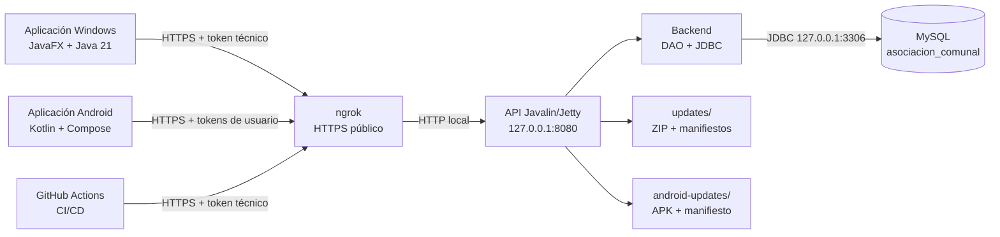
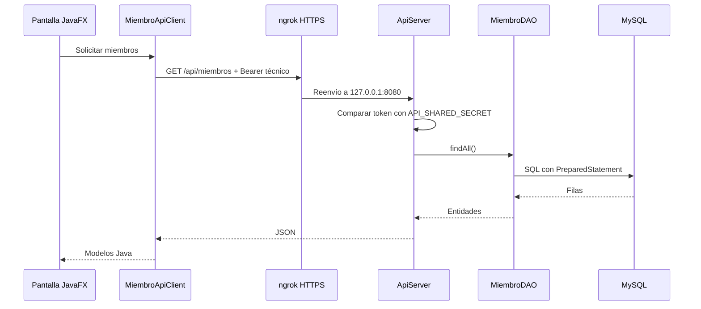
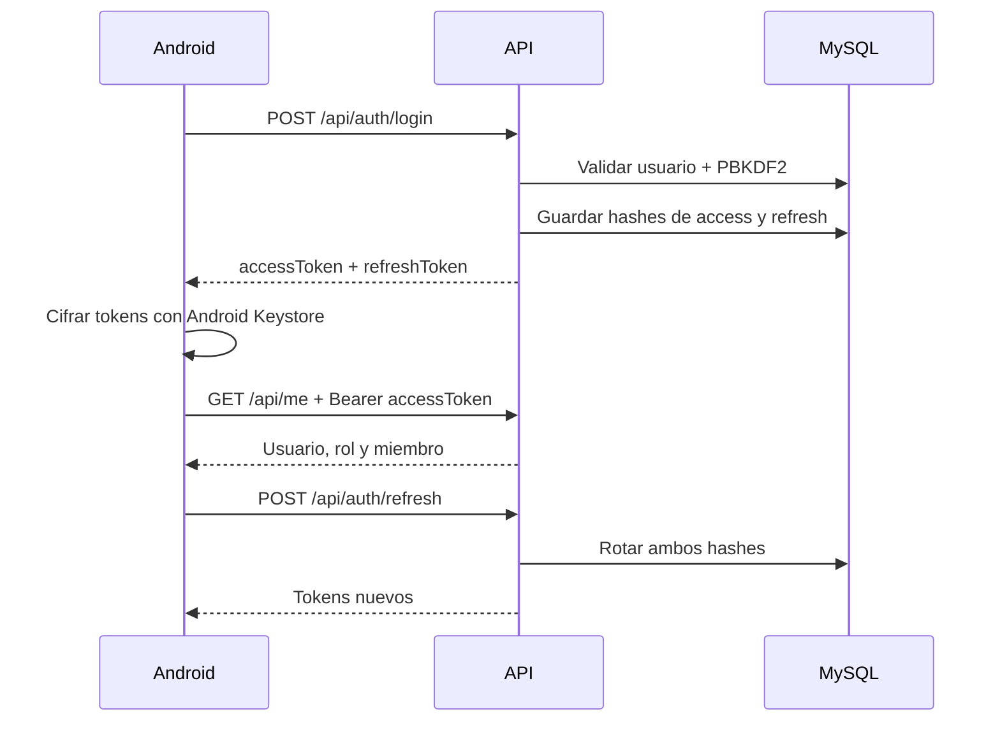
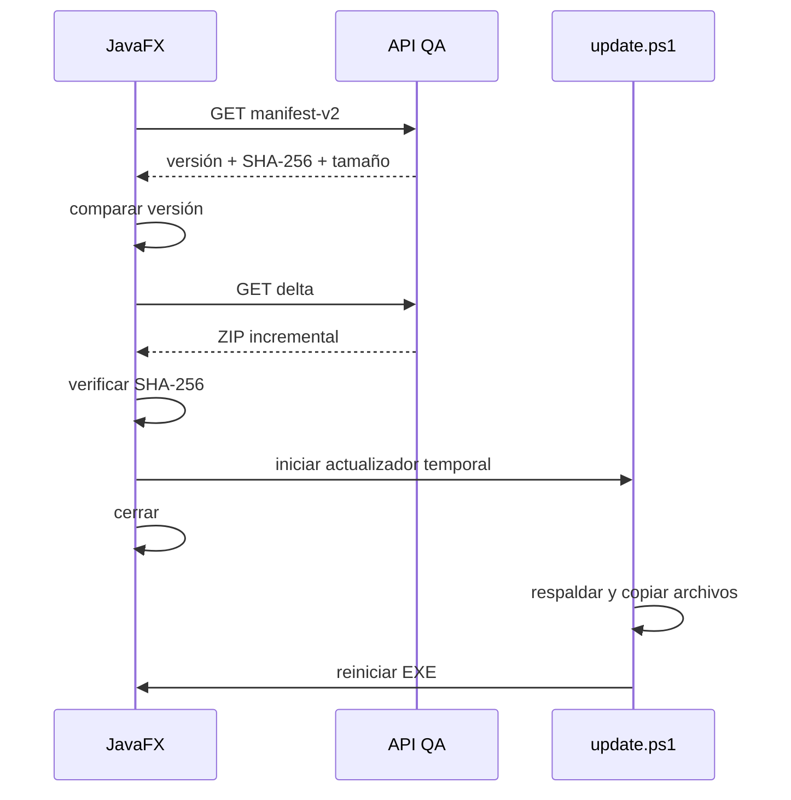

# Guía completa de operación, servidor y actualizaciones

> Manual técnico y operativo del sistema **Asociación Comunal**.
> Estado revisado: **20 de agosto de 2026**.
> Rama publicada revisada: `origin/develop` en `af69072` (`qa-v1.4.6`).

## 1. Propósito de esta guía

Esta guía explica, de principio a fin:

- cómo está dividido el sistema;
- cómo se ejecuta el servidor;
- cómo se conecta la aplicación Windows con la API;
- cómo se conecta Android con la API;
- cómo llega la API hasta MySQL;
- cómo funcionan la autenticación técnica y la autenticación de usuarios;
- cómo se construyen y publican actualizaciones de Windows;
- cómo se construyen y publican actualizaciones de Android;
- cómo se actualiza el propio JAR de la API;
- cómo se aplican migraciones de base de datos;
- cómo validar, diagnosticar, revertir y recuperar una publicación;
- qué riesgos y limitaciones existen en la implementación actual.

Esta no es una guía para copiar secretos. Los ejemplos usan nombres como
`QA_API_TOKEN`, `API_SHARED_SECRET`, `USUARIO_SERVIDOR` y `URL_QA`. Nunca se
deben reemplazar esos nombres por valores reales dentro de Git, documentos,
capturas, tickets o mensajes.

### 1.1 Fuentes de verdad utilizadas

El repositorio tiene componentes en distintos niveles de integración. Esta guía
los documenta juntos para explicar el diseño completo, pero no afirma que todos
estén publicados en `develop`.

| Fuente | Contenido relevante | Estado al 20-08-2026 |
| --- | --- | --- |
| `origin/develop` (`af69072`) | Empaquetado, actualización y publicación Windows corregidos | Oficial `qa-v1.4.6` |
| `feature/dui-temporary-password` | Autenticación de API, Android y migraciones `V002`/`V003` | Rama feature, no integrada en `develop` |
| Árbol de trabajo local | Reactor Maven raíz, viviendas, `V004`, `V005` y otros cambios | Sin commit o sin publicación |

Antes de operar el servidor se debe identificar el commit que realmente está
desplegado. El servidor podría haber sido actualizado manualmente desde una
rama distinta, por lo que una etiqueta Windows no demuestra qué JAR de API se
está ejecutando.

---

## 2. Respuesta rápida al caso `1.4.6` frente a `1.4.8`

Actualmente hay dos estados diferentes:

| Lugar | Versión observada | Qué significa |
| --- | ---: | --- |
| GitHub / rama `develop` | `qa-v1.4.6` | Última entrega oficial confirmada. |
| Servidor QA | `1.4.6` | Es la versión que anuncia el manifiesto remoto, según la comprobación del equipo. |
| Carpeta local `dist/` | `1.4.8` | Paquete construido localmente; no equivale a una publicación. |

La aplicación no consulta la carpeta `dist/` de la computadora del desarrollador.
Consulta el endpoint remoto:

```text
GET /api/updates/windows/manifest-v2
```

Por eso detecta `1.4.6`: esa es la versión activada en el servidor. El archivo
local `dist/version.txt` con `1.4.8` no se copia solo al servidor.

Además, la `1.4.8` local se construyó desde un árbol de trabajo con cambios sin
commit. No debe publicarse como entrega oficial porque no se puede reconstruir
de manera confiable desde un commit de Git.

Regla fundamental:

> **Construido localmente no significa publicado.** Una versión está publicada
> cuando el servidor contiene sus artefactos activos y su manifiesto remoto
> anuncia ese número.

---

## 3. Conceptos que no se deben confundir

En este proyecto existen cuatro tipos de actualización independientes:

| Tipo | Qué cambia | Destino |
| --- | --- | --- |
| Aplicación Windows QA | JavaFX, recursos, librerías y, ocasionalmente, lanzador | Computadoras de QA |
| Aplicación Android | APK firmado | Teléfonos Android |
| API del servidor | `asociacion-api.jar` | Laptop/servidor Linux |
| Base de datos | Tablas, columnas, índices y datos de estructura | MySQL |

Publicar Windows no reemplaza el JAR de la API. Reemplazar el JAR de la API no
aplica migraciones. Publicar Android no modifica Windows. Cada cambio necesita
su propio procedimiento y sus propias verificaciones.

### Términos utilizados

- **API**: proceso Java/Javalin que recibe solicitudes HTTP.
- **Servidor**: equipo Linux que ejecuta MySQL, la API y el túnel ngrok.
- **QA**: ambiente y paquetes utilizados para pruebas.
- **Paquete completo**: ZIP autocontenido para una instalación nueva de Windows.
- **Delta**: ZIP que contiene solamente archivos modificados de Windows.
- **Manifiesto**: JSON con versión, tamaño y SHA-256 del delta.
- **Token técnico**: secreto compartido usado temporalmente por JavaFX, CI y
  rutas administrativas.
- **Access token**: token corto de una sesión individual de usuario.
- **Refresh token**: token largo que permite renovar una sesión individual.
- **Publicar**: transferir y activar artefactos en la API remota.
- **GitHub Release**: copia descargable de un artefacto; no demuestra por sí
  sola que el job de despliegue a la API terminó correctamente.

---

## 4. Arquitectura general

El diagrama representa la arquitectura implementada o en integración en la rama
de trabajo. La parte de autenticación Android/API todavía no pertenece a
`origin/develop`.



### Principio de red

La API se enlaza exclusivamente a:

```text
127.0.0.1:8080
```

No escucha directamente en la red pública. ngrok mantiene un dominio HTTPS y
reenvía las solicitudes hacia `127.0.0.1:8080`. MySQL permanece en el servidor
y no debe exponer el puerto `3306` a Internet.

### Flujo de una consulta normal de JavaFX



---

## 5. Módulos del repositorio

| Ruta | Responsabilidad | Resultado |
| --- | --- | --- |
| `backend/` | Entidades, DAOs y conexión JDBC a MySQL | `backend-1.0-SNAPSHOT.jar` |
| `api/` | Servidor Javalin, rutas HTTP, autenticación y publicación | `asociacion-api.jar` |
| `frontend/` | Aplicación administrativa JavaFX | JAR + paquete Windows |
| `android-app/` | Cliente Android independiente | APK |
| `database/migrations/` | Migraciones SQL manuales | Archivos SQL |
| `scripts/` | Generación de configuración y paquetes QA | ZIP, delta y manifiestos |
| `.github/workflows/` | Automatización de Windows y Android | Actions, artifacts y releases |

El árbol local contiene un `pom.xml` raíz que define este orden:

```text
backend -> api -> frontend
```

Ese `pom.xml` raíz aún no está versionado en `origin/develop`. Por tanto, en un
checkout limpio oficial se deben construir los módulos por separado hasta que
el reactor sea revisado e integrado.

La API depende del backend. El `maven-shade-plugin` empaqueta ambos, junto con
las dependencias, en un solo JAR ejecutable:

```text
api/target/asociacion-api.jar
```

Android no pertenece al reactor Maven. Utiliza su propio Gradle Wrapper.

---

## 6. Cómo está construido el servidor

### 6.1 Procesos permanentes

El servidor utiliza servicios de usuario de systemd:

| Servicio | Función |
| --- | --- |
| `asociacion-api.service` | Ejecuta el JAR de la API con Java 21. |
| `asociacion-ngrok.service` | Publica por HTTPS la API local. |
| `mysql.service` | Aloja el esquema `asociacion_comunal`. |

`asociacion-ngrok.service` depende de `asociacion-api.service`. Ambos se
reinician automáticamente si fallan.

### 6.2 Rutas del servidor

```text
~/.config/asociacion-comunal/api.env
~/.config/systemd/user/asociacion-api.service
~/.config/systemd/user/asociacion-ngrok.service
~/.local/opt/temurin-21-jre/bin/java
~/.local/bin/ngrok
~/apps/asociacion-api/current -> releases/<versión-del-servidor>
~/apps/asociacion-api/releases/<versión>/asociacion-api.jar
~/apps/asociacion-api/updates/
~/apps/asociacion-api/android-updates/
```

`current` es un enlace simbólico. Eso permite instalar un JAR nuevo en una
carpeta versionada y cambiar el enlace sin borrar la versión anterior.

### 6.3 Configuración privada

`~/.config/asociacion-comunal/api.env` debe tener permisos `600` y contiene:

```dotenv
API_PORT=8080
API_SHARED_SECRET=SECRETO_ALEATORIO_DE_AL_MENOS_32_CARACTERES
DB_HOST=127.0.0.1
DB_PORT=3306
DB_NAME=asociacion_comunal
DB_USER=asociacion_api
DB_PASSWORD=CONTRASEÑA_ALEATORIA
AUTH_ACCESS_TTL_MINUTES=15
AUTH_REFRESH_TTL_DAYS=30
```

El servicio systemd carga este archivo mediante `EnvironmentFile`. Los valores
no se guardan en Git ni se incluyen dentro del JAR.

### 6.4 Usuario MySQL

El script `api/deploy/create-db-user.sh` crea el usuario `asociacion_api` para
conexiones desde `localhost` y le concede únicamente:

```text
SELECT, INSERT, UPDATE, DELETE
```

Ese usuario no tiene permisos para crear o alterar tablas. Las migraciones se
deben ejecutar con una cuenta administrativa separada y de forma interactiva.

### 6.5 Directorios de actualizaciones

Windows utiliza:

```text
~/apps/asociacion-api/updates/
├── AsociacionComunalQA-<versión>-win64.zip
├── AsociacionComunalQA-<versión>-delta.zip
├── AsociacionComunalQA-win64.zip
├── AsociacionComunalQA-delta.zip
├── update-manifest.json
├── version.txt
└── sha256.txt
```

Android utiliza:

```text
~/apps/asociacion-api/android-updates/
├── AsociacionComunalAndroid.apk
├── version.txt
├── sha256.txt
└── notes.txt
```

Los nombres sin versión son los artefactos activos. Los endpoints de descarga
leen esos nombres estables.

---

## 7. Cómo se conecta Windows con el servidor

### 7.1 Configuración que busca JavaFX

`QaApiConfig` busca, en este orden:

1. `QA_API_URL` y `QA_API_TOKEN` como variables de entorno;
2. la ruta indicada por la propiedad Java `qa.config`;
3. `config/qa.properties` junto al ejecutable empaquetado;
4. `qa-local.properties` durante el desarrollo.

El archivo tiene esta forma:

```properties
api.url=https://URL_QA
api.token=EL_MISMO_VALOR_DE_API_SHARED_SECRET
```

La URL de JavaFX debe usar HTTPS. El token debe tener al menos 32 caracteres.

### 7.2 Qué credencial utiliza hoy

Las consultas administrativas del escritorio todavía utilizan el token técnico
compartido:

```http
Authorization: Bearer <API_SHARED_SECRET>
```

Esto incluye miembros, proyectos, viviendas y actualizaciones. Es una solución
transitoria: el token queda incorporado en `config/qa.properties` dentro del
paquete completo de Windows.

### 7.3 Estado real del login del escritorio

El formulario de login de JavaFX todavía valida usuarios simulados en memoria.
No consulta `/api/auth/login`. En consecuencia:

- iniciar sesión en JavaFX no crea una sesión en MySQL;
- el nombre y rol mostrados provienen del repositorio simulado;
- las consultas posteriores sí pueden ir a la API usando el token técnico;
- el login de JavaFX debe migrarse a la autenticación oficial antes de producción.

No se debe confundir “pude entrar a JavaFX” con “la autenticación del servidor
funciona”. Son mecanismos diferentes en el estado actual.

### 7.4 Encabezado de ngrok

Los clientes agregan:

```http
ngrok-skip-browser-warning: 1
```

Esto evita la página informativa del plan gratuito de ngrok en solicitudes de
aplicación. No sustituye HTTPS ni autenticación.

---

## 8. Cómo se conecta Android con el servidor

Android, implementado en la rama feature pero aún no integrado en `develop`,
recibe la URL en compilación mediante:

```text
-PAPI_BASE_URL=https://URL_QA/
```

Retrofit exige `/` al final. En emulador, el valor de desarrollo
`http://10.0.2.2:8080/` apunta a la computadora anfitriona.

### 8.1 Autenticación de usuarios

Android usa sesiones reales:



Los tokens son opacos y aleatorios; no son JWT. MySQL almacena únicamente
SHA-256 de los tokens. El dispositivo cifra los valores reales con AES-GCM y
una clave protegida por Android Keystore antes de guardarlos en DataStore.

Valores predeterminados:

| Token | Duración |
| --- | ---: |
| Access token | 15 minutos |
| Refresh token | 30 días |

El refresh token rota cada vez que se utiliza. El logout revoca la sesión.

### 8.2 Requisitos de identidad

Para iniciar sesión deben existir:

- un registro activo en `usuario`;
- un rol permitido;
- un hash PBKDF2 válido;
- para `MIEMBRO`, un miembro asociado y activo;
- las migraciones `V002` y `V003` aplicadas.

---

## 9. Rutas principales de la API

### 9.1 Salud

| Método | Ruta | Acceso | Función |
| --- | --- | --- | --- |
| `GET` | `/health` | Público | Comprueba API y conexión MySQL. |

### 9.2 Sesiones de usuario

Estas rutas pertenecen actualmente a la implementación de la rama feature. No
se deben considerar disponibles en el JAR construido desde `origin/develop`
sin integrar primero código y migraciones.

| Método | Ruta | Acceso |
| --- | --- | --- |
| `POST` | `/api/auth/login` | Público |
| `POST` | `/api/auth/refresh` | Refresh token en JSON |
| `POST` | `/api/auth/logout` | Refresh token en JSON |
| `POST` | `/api/auth/change-password` | Access token |
| `GET` | `/api/me` | Access token |

### 9.3 Administración temporalmente protegida por token técnico

| Método | Ruta | Función |
| --- | --- | --- |
| `GET`, `POST` | `/api/miembros` | Listar o crear miembros. |
| `GET` | `/api/proyectos` | Listar proyectos. |
| `GET`, `POST` | `/api/viviendas` | Listar o crear viviendas. |
| `GET`, `PUT`, `DELETE` | `/api/viviendas/{id}` | Consultar, modificar o desactivar. |

### 9.4 Actualizaciones Windows

| Método | Ruta | Función |
| --- | --- | --- |
| `GET` | `/api/updates/windows/manifest` | Compatibilidad con clientes antiguos. |
| `GET` | `/api/updates/windows/manifest-v2` | Versión, hash y tamaño del delta. |
| `GET` | `/api/updates/windows/build-manifest` | Hashes de archivos para construir el siguiente delta. |
| `GET` | `/api/updates/windows/package` | ZIP completo activo. |
| `GET` | `/api/updates/windows/delta` | ZIP incremental activo. |
| `POST` | `/api/updates/windows/publish` | Publicar y activar una entrega. |

Todas requieren token técnico.

### 9.5 Actualizaciones Android

| Método | Ruta | Acceso |
| --- | --- | --- |
| `GET` | `/api/mobile/updates/android/manifest` | Público |
| `GET` | `/api/mobile/updates/android/package` | Público |
| `POST` | `/api/updates/android/publish` | Token técnico |

---

## 10. Reglas de versionado

### 10.1 Comparación

Windows y Android comparan componentes numéricos:

```text
1.4.10 > 1.4.9 > 1.4.6
```

No se admiten sufijos como `1.4.9-beta` en el comparador actual. Tampoco existe
actualización hacia abajo:

```text
instalada 1.4.8 + publicada 1.4.6 = no ofrecer actualización
```

### 10.2 Versión automática de Windows

GitHub Actions genera:

```text
1.4.<github.run_number>
```

El número de ejecución pertenece al workflow, no al contenido de `dist/`.

### 10.3 Versión automática de Android

El workflow de la rama de trabajo genera actualmente:

```text
0.2.<github.run_number>
```

El `versionCode` se calcula como:

```text
200000 + github.run_number
```

Atención: el proyecto local tiene un `versionName` predeterminado `0.3.0`,
mientras el workflow observado utiliza la serie `0.2.x`. Antes de integrar ese
workflow se debe unificar la estrategia de versión para evitar que Android no
detecte una entrega `0.2.x` como superior a `0.3.0`.

### 10.4 Fuente de verdad

Para una versión oficial deben coincidir:

- commit de Git;
- versión del paquete;
- `version.txt`;
- versión de `update-manifest.json`;
- nombre de los ZIP;
- versión publicada por la API;
- GitHub Release.

---

## 11. Flujo Git correcto antes de publicar

### 11.1 Estado actual que debe resolverse

Al 20 de agosto de 2026:

- la rama activa es `feature/dui-temporary-password`;
- tiene un commit local sin subir;
- tiene archivos modificados y archivos nuevos sin commit;
- está divergida respecto a `origin/develop`;
- `origin/develop` ya contiene correcciones del actualizador Windows;
- `V004`, `V005` y el workflow Android todavía no están integrados en
  `origin/develop`.

No se debe publicar el `dist/1.4.8` actual como si fuera una entrega oficial.

### 11.2 Preparación segura

```powershell
git status --short --branch
git fetch --prune origin
git log --graph --decorate --oneline --all -n 40
git diff --stat
```

Separar los cambios por propósito. Agregar únicamente rutas revisadas:

```powershell
git add -- ruta/revisada1 ruta/revisada2
git diff --cached
git commit -m "feat(TICKET): descripción comprobable"
```

No utilizar `git add .` ni mezclar documentos, migraciones y funcionalidad no
relacionada en un único commit.

Después de guardar el trabajo, integrar los cambios recientes de `develop` en
la rama feature según la política del equipo, resolver conflictos y ejecutar
pruebas. Luego:

```text
feature -> push -> Pull Request -> revisión -> merge a develop
```

El `push` o merge efectivo a `develop` es lo que dispara la publicación Windows.
Una modificación que solo existe localmente no puede llegar a QA.

---

## 12. Publicación automática de Windows — procedimiento recomendado

### 12.1 Requisitos de GitHub

Secrets requeridos:

- `QA_API_URL`;
- `QA_API_TOKEN`.

`QA_API_TOKEN` debe coincidir con `API_SHARED_SECRET` del servidor.

### 12.2 Activación

El workflow `Compilar y publicar QA` se ejecuta:

- automáticamente con un `push` a `develop`;
- manualmente con `workflow_dispatch`;
- en ejecución manual solo publica si se marca **Publicar esta compilación para
  los QA**.

### 12.3 Qué hace el job de construcción

1. Descarga el commit exacto.
2. Configura Java 21.
3. Valida que URL y token existan y que la URL sea HTTPS.
4. Intenta descargar del servidor el paquete y manifiesto actuales.
5. Si existe una base válida, conserva lanzador/runtime y calcula un delta.
6. Si no existe base, genera una primera instalación completa.
7. En la versión oficial observada, compila `backend` con sus pruebas omitidas
   y empaqueta/prueba `frontend`. El workflow no construye ni prueba el módulo
   `api`; esta brecha se registra en las limitaciones de esta guía.
8. Ejecuta `jpackage`.
9. Inyecta la versión como propiedad Java:

   ```text
   -Dasociacion.app.version=<versión>
   ```

10. Genera los cinco artefactos.
11. Los sube como artifact de GitHub durante 30 días.

### 12.4 Artefactos

```text
AsociacionComunalQA-<versión>-win64.zip
AsociacionComunalQA-<versión>-delta.zip
update-manifest.json
version.txt
sha256.txt
```

- `win64.zip`: instalación completa.
- `delta.zip`: archivos cambiados.
- `update-manifest.json`: versión, SHA-256 y tamaño del delta, más hashes de
  archivos.
- `version.txt`: versión publicada.
- `sha256.txt`: SHA-256 del ZIP completo.

### 12.5 Publicación a la API

El job `deploy-qa` envía los cinco artefactos como `multipart/form-data` a:

```text
POST /api/updates/windows/publish
```

La API:

1. comprueba que la versión tenga forma `x.y.z`;
2. comprueba que `version.txt` coincida con el manifiesto;
3. copia primero a un directorio temporal;
4. conserva los ZIP con nombre versionado;
5. reemplaza los nombres estables activos;
6. activa manifiesto, versión y checksum.

### 12.6 GitHub Release

El job `release-github` crea `qa-v<versión>` con el ZIP completo. Los jobs
`deploy-qa` y `release-github` dependen de la construcción, pero son
independientes entre sí.

Consecuencia:

> Ver `qa-v1.4.6` demuestra que el Release se creó; para confirmar el servidor
> también se debe revisar `deploy-qa` y consultar el manifiesto remoto.

### 12.7 Validación después del merge

En GitHub Actions verificar:

- `Probar y crear paquetes`: verde;
- `Activar actualización QA`: verde;
- `Publicar aplicación en GitHub`: verde.

Después consultar salud pública:

```powershell
$BaseUrl = "https://URL_QA"
Invoke-RestMethod -Uri "$BaseUrl/health" `
  -Headers @{ "ngrok-skip-browser-warning" = "1" }
```

Respuesta esperada:

```json
{"service":"asociacion-api","database":"available"}
```

Para consultar el manifiesto se debe usar el token autorizado sin imprimirlo.
Cerrar la terminal después de la operación o eliminar las variables creadas.

---

## 13. Qué hace el cliente Windows al encontrar una actualización

La implementación corregida de `origin/develop`:

1. inicia el actualizador una sola vez al abrir la aplicación;
2. espera aproximadamente 3 segundos;
3. vuelve a comprobar cada 15 minutos;
4. solo se activa en una aplicación empaquetada;
5. determina la versión mediante `asociacion.app.version`, con compatibilidad
   para `jpackage.app-version`;
6. solicita `manifest-v2` con token técnico;
7. compara versión remota y versión instalada;
8. muestra confirmación si la remota es superior;
9. descarga el delta a una ruta temporal;
10. muestra progreso;
11. verifica SHA-256;
12. crea un script PowerShell temporal;
13. cierra JavaFX;
14. el script espera la terminación del proceso;
15. respalda archivos existentes que serán sustituidos;
16. copia el delta sobre la instalación;
17. reinicia `AsociacionComunalQA.exe`;
18. restaura el respaldo si ocurre un error durante la copia.



Si el usuario cancela, esa misma versión no se vuelve a ofrecer durante la
misma ejecución. Al reiniciar la aplicación puede aparecer de nuevo.

---

## 14. Primera instalación y clientes antiguos

Una computadora nueva debe descargar el ZIP completo de una GitHub Release,
extraer la carpeta completa y ejecutar:

```text
AsociacionComunalQA.exe
```

No se debe ejecutar el EXE desde dentro del ZIP.

Las versiones antiguas anteriores a las correcciones de `1.4.5`/`1.4.6` pueden
no localizar correctamente el ejecutable o la versión. Para recuperar una
instalación así:

1. cerrar la aplicación;
2. conservar una copia de la carpeta antigua;
3. descargar el ZIP completo oficial `qa-v1.4.6` o una versión oficial mayor;
4. extraerlo en una carpeta nueva;
5. ejecutar el nuevo EXE;
6. comprobar la versión visible;
7. probar la siguiente actualización incremental.

Esta instalación completa actúa como **bootstrap** del actualizador corregido.

Si una computadora ejecutó el paquete local `1.4.8` y el servidor publica
`1.4.6` o `1.4.7`, no habrá actualización. Las opciones correctas son:

- reinstalar la última versión oficial; o
- publicar una entrega oficial estrictamente superior a `1.4.8`.

No se debe falsificar ni bajar la versión remota.

---

## 15. Construcción manual de Windows

La publicación automática es la ruta recomendada. La construcción manual sirve
para validación local o una emergencia controlada.

### 15.1 Prerrequisitos

- Windows de 64 bits;
- JDK 21 completo con `jpackage.exe`;
- Maven 3.9.x;
- configuración QA autorizada;
- árbol Git limpio y commit identificable;
- versión superior a la publicada.

### 15.2 Construir

```powershell
$Version = "1.4.9"
powershell.exe -NoProfile -ExecutionPolicy Bypass `
  -File .\scripts\build-qa-package.ps1 `
  -Version $Version `
  -PreviousManifest .\dist\update-manifest-anterior.json `
  -LegacyImage .\dist\imagen-anterior\AsociacionComunalQA
```

`PreviousManifest` y `LegacyImage` son opcionales. Sin base se construye una
instalación completa y el delta contendrá más archivos.

### 15.3 Validaciones obligatorias

```powershell
$Version = "1.4.9"
$Manifest = Get-Content .\dist\update-manifest.json -Raw | ConvertFrom-Json
$Delta = ".\dist\AsociacionComunalQA-$Version-delta.zip"
$Full = ".\dist\AsociacionComunalQA-$Version-win64.zip"

if ($Manifest.version -ne $Version) { throw "Versión de manifiesto incorrecta" }
if (-not (Test-Path $Delta)) { throw "Falta el delta" }
if (-not (Test-Path $Full)) { throw "Falta el paquete completo" }

$DeltaHash = (Get-FileHash $Delta -Algorithm SHA256).Hash.ToLowerInvariant()
if ($DeltaHash -ne $Manifest.sha256) { throw "SHA-256 del delta incorrecto" }

$ExpectedFullHash = (Get-Content .\dist\sha256.txt -Raw).Trim().ToLowerInvariant()
$ActualFullHash = (Get-FileHash $Full -Algorithm SHA256).Hash.ToLowerInvariant()
if ($ActualFullHash -ne $ExpectedFullHash) { throw "SHA-256 del paquete completo incorrecto" }
```

También revisar el ZIP del delta. Debe contener rutas como:

```text
app/app/AsociacionComunalQA.cfg
app/app/AsociacionComunal-1.0-SNAPSHOT.jar
```

La doble carpeta `app/app` es intencional.

### 15.4 Publicación manual autenticada

Solo un operador autorizado debe realizarla. El siguiente ejemplo lee la URL y
el token desde `qa-local.properties` sin mostrarlos:

```powershell
$Version = "1.4.9"
$Qa = @{}
Get-Content .\qa-local.properties | ForEach-Object {
  if ($_ -match '^([^#][^=]*)=(.*)$') {
    $Qa[$Matches[1].Trim()] = $Matches[2].Trim()
  }
}

$BaseUrl = $Qa['api.url'].TrimEnd('/')
$Headers = @{
  Authorization = "Bearer $($Qa['api.token'])"
  'ngrok-skip-browser-warning' = '1'
}

$Form = @{
  full = Get-Item ".\dist\AsociacionComunalQA-$Version-win64.zip"
  delta = Get-Item ".\dist\AsociacionComunalQA-$Version-delta.zip"
  manifest = Get-Item '.\dist\update-manifest.json'
  version = Get-Item '.\dist\version.txt'
  checksum = Get-Item '.\dist\sha256.txt'
}

$Result = Invoke-RestMethod -Method Post `
  -Uri "$BaseUrl/api/updates/windows/publish" `
  -Headers $Headers `
  -Form $Form

$Result
Remove-Variable Qa, Headers, Form -ErrorAction SilentlyContinue
```

No pegar el token en el comando ni escribirlo en logs. Esta operación transmite
el token y los artefactos al servidor indicado; se debe verificar cuidadosamente
el dominio antes de ejecutarla.

### 15.5 Comprobar la publicación

Volver a consultar `manifest-v2` con la misma configuración y confirmar:

- versión correcta;
- tamaño distinto de cero;
- SHA-256 igual al delta local;
- aplicación antigua ofrece la actualización;
- aplicación nueva no vuelve a ofrecerla.

---

## 16. Actualizaciones Android

### 16.1 Estado de integración

El código Android y su workflow existen en la rama de trabajo, pero el archivo
`.github/workflows/android-release.yml` no está actualmente en
`origin/develop`. Por eso no se debe asumir que cada merge a `develop` publicará
Android hasta integrar y revisar ese workflow.

### 16.2 Secrets requeridos

- `QA_API_URL`;
- `QA_API_TOKEN`;
- `ANDROID_KEYSTORE_BASE64`;
- `ANDROID_KEYSTORE_PASSWORD`;
- `ANDROID_KEY_ALIAS`;
- `ANDROID_KEY_PASSWORD`.

El keystore nunca debe guardarse en Git.

### 16.3 Flujo de CI

1. Configura Java 21.
2. Restaura temporalmente el keystore desde Base64.
3. Ejecuta pruebas unitarias.
4. Compila un APK release firmado.
5. Inyecta URL, `versionName` y `versionCode`.
6. Calcula SHA-256.
7. Publica el APK mediante `/api/updates/android/publish`.
8. Crea una GitHub Release.

### 16.4 Flujo en el teléfono

1. La aplicación consulta el manifiesto público.
2. Compara `versionName`.
3. Muestra notas si existe una versión superior.
4. Descarga el APK al caché de la aplicación.
5. Solicita permiso para instalar desde esta fuente si hace falta.
6. Abre el instalador oficial de Android con `FileProvider`.
7. Android valida la firma antes de sustituir la aplicación.

La misma clave de firma debe conservarse para todas las versiones. Perderla
impide actualizar una instalación existente con un APK nuevo.

---

## 17. Actualizar el JAR de la API

No existe actualmente un workflow que despliegue automáticamente el JAR al
servidor. La actualización de API es manual y separada de los paquetes QA.

### 17.1 Antes de construir

1. Confirmar qué commit será desplegado.
2. Revisar si el código requiere migraciones.
3. Respaldar MySQL si habrá cambios de esquema.
4. Ejecutar pruebas.
5. Confirmar que el árbol de trabajo de la entrega es reproducible.

```powershell
git status --short --branch
git rev-parse HEAD
mvn -f .\backend\pom.xml clean install
mvn -f .\api\pom.xml clean package
mvn -f .\frontend\pom.xml clean test
```

Resultado:

```text
api/target/asociacion-api.jar
```

### 17.2 Transferir sin reemplazar la versión activa

Desde Windows, usando valores autorizados:

```powershell
$Server = "USUARIO_SERVIDOR@HOST_SERVIDOR"
scp .\api\target\asociacion-api.jar "$Server`:~/asociacion-api.jar.upload"
```

No copiar directamente sobre `current/asociacion-api.jar` mientras el proceso
está activo.

### 17.3 Instalar una versión nueva en Linux

En una sesión SSH:

```bash
set -euo pipefail
release_id="2026-08-20-01"
app_root="$HOME/apps/asociacion-api"
release_dir="$app_root/releases/$release_id"

install -d -m 700 "$release_dir"
install -m 500 "$HOME/asociacion-api.jar.upload" "$release_dir/asociacion-api.jar"
rm -f "$HOME/asociacion-api.jar.upload"

previous_release="$(readlink -f "$app_root/current")"
ln -sfn "$release_dir" "$app_root/current"
systemctl --user restart asociacion-api.service
```

Conservar `previous_release` durante la ventana de validación.

### 17.4 Validar

```bash
systemctl --user is-active asociacion-api.service
curl --fail --silent --show-error http://127.0.0.1:8080/health
journalctl --user -u asociacion-api.service -n 100 --no-pager
```

Después probar el dominio HTTPS desde otra máquina.

### 17.5 Reversión del JAR

Si el nuevo JAR falla y no existe incompatibilidad de esquema:

```bash
app_root="$HOME/apps/asociacion-api"
previous_release="/ruta/absoluta/de/la/version/anterior"
ln -sfn "$previous_release" "$app_root/current"
systemctl --user restart asociacion-api.service
curl --fail --silent --show-error http://127.0.0.1:8080/health
```

No revertir el JAR automáticamente después de una migración incompatible. En
ese caso se necesita el plan conjunto de aplicación y base de datos.

---

## 18. Instalación inicial del servidor

Los scripts existentes suponen que ya están instalados:

- Linux con systemd de usuario;
- MySQL;
- Java 21 en `~/.local/opt/temurin-21-jre`;
- ngrok en `~/.local/bin/ngrok`;
- un dominio/túnel ngrok configurado;
- acceso SSH y permisos de `sudo mysql` para la preparación inicial.

### 18.1 Construir localmente

```powershell
mvn -f .\backend\pom.xml clean install
mvn -f .\api\pom.xml clean package
```

### 18.2 Subir archivos iniciales

Subir con sufijo `.upload`:

```text
asociacion-api.jar.upload
asociacion-api.service.upload
asociacion-ngrok.service.upload
```

También transferir temporalmente:

```text
install-server.sh
create-db-user.sh
```

### 18.3 Ejecutar preparación

`install-server.sh`:

- crea la estructura de directorios;
- instala el primer JAR;
- instala units de systemd;
- genera `API_SHARED_SECRET` si no existe `api.env`;
- deja usuario y contraseña de MySQL pendientes;
- elimina archivos `.upload`.

`create-db-user.sh`:

- genera contraseña aleatoria de MySQL;
- crea o actualiza `asociacion_api@localhost`;
- aplica mínimo privilegio;
- actualiza `api.env`;
- habilita e inicia API y ngrok;
- comprueba `/health` durante 15 segundos.

### 18.4 Persistencia de servicios de usuario

Comprobar que los servicios de usuario pueden permanecer activos después de
cerrar la sesión. En algunos servidores se requiere que un administrador
configure `loginctl enable-linger` para el usuario del servicio.

---

## 19. Migraciones de base de datos

### 19.1 Estado actual

No se utiliza Flyway ni Liquibase. Tampoco existe `V001` en el repositorio. Las
migraciones incluidas asumen que el esquema base ya tiene las tablas originales.

Orden conocido:

1. `V002__crear_sesion_usuario.sql`;
2. `V003__forzar_cambio_clave_temporal.sql`;
3. `V004__tipo_documento_miembro.sql`;
4. `V005__crear_viviendas_y_residentes.sql`.

Al 20 de agosto de 2026, `V004` y `V005` son archivos locales sin commit. No se
deben aplicar al ambiente QA como parte de una entrega oficial hasta integrar,
revisar y coordinar el código que depende de ellas.

### 19.2 Respaldo obligatorio

Ejemplo desde el servidor con una cuenta administrativa interactiva:

```bash
backup_file="asociacion_comunal-$(date +%Y%m%d-%H%M%S).sql"
mysqldump -u USUARIO_ADMIN -p --single-transaction --routines --triggers \
  asociacion_comunal > "$backup_file"
test -s "$backup_file"
sha256sum "$backup_file"
```

Guardar el respaldo fuera del directorio de la aplicación y limitar permisos.
Nunca subirlo a Git.

### 19.3 Revisar antes de aplicar

```sql
SELECT DATABASE();
SHOW TABLES;
SHOW COLUMNS FROM usuario;
SHOW COLUMNS FROM miembro;
```

Confirmar que la migración no fue aplicada. Como no hay historial automático,
el equipo debe registrar manualmente ambiente, archivo, hash, fecha y operador.

### 19.4 Aplicar

Usar la cuenta administrativa, no `asociacion_api`:

```bash
mysql -u USUARIO_ADMIN -p asociacion_comunal \
  < database/migrations/V002__crear_sesion_usuario.sql
```

Aplicar una migración por vez y validar antes de continuar.

### 19.5 Después de aplicar

```sql
SHOW TABLES;
SHOW COLUMNS FROM usuario;
SHOW CREATE TABLE sesion_usuario;
```

Reiniciar la API únicamente si la nueva versión de código ya está preparada y
el plan de despliegue lo requiere.

---

## 20. Rotación de URL y token técnico

### 20.1 Dependencias del token

El mismo valor debe coincidir en:

- `API_SHARED_SECRET` del servidor;
- secreto GitHub `QA_API_TOKEN`;
- `qa-local.properties` de desarrollo;
- `config/qa.properties` de paquetes Windows instalados.

### 20.2 Limitación importante

El delta Windows se construye a partir de la carpeta `app/`. El archivo
`config/qa.properties` está fuera de esa carpeta y no se incluye en el delta.

Por eso, cambiar `API_SHARED_SECRET` rompe la autenticación de clientes ya
instalados y esos mismos clientes no pueden descargar el delta que podría
repararlos. Con la implementación actual, una rotación requiere distribuir un
paquete completo con la configuración nueva o implementar primero una estrategia
de transición con más de un token.

### 20.3 Cambio de URL

Cambiar la URL requiere coordinar:

- unit `asociacion-ngrok.service`;
- secreto GitHub `QA_API_URL`;
- configuración Windows;
- `API_BASE_URL` de Android;
- nuevo paquete completo o mecanismo de migración de configuración.

No apagar la URL anterior antes de confirmar que los clientes pueden conocer la
nueva.

---

## 21. Monitoreo y diagnóstico

### 21.1 Estado de servicios

```bash
systemctl --user status asociacion-api.service --no-pager
systemctl --user status asociacion-ngrok.service --no-pager
systemctl --user is-active asociacion-api.service asociacion-ngrok.service
```

### 21.2 Logs

```bash
journalctl --user -u asociacion-api.service -n 200 --no-pager
journalctl --user -u asociacion-ngrok.service -n 200 --no-pager
journalctl --user -u asociacion-api.service -f
```

Nunca copiar logs completos sin revisar que no contengan información sensible.

### 21.3 Salud local y externa

```bash
curl --fail --silent --show-error http://127.0.0.1:8080/health
```

Desde Windows:

```powershell
Invoke-RestMethod "https://URL_QA/health" `
  -Headers @{ 'ngrok-skip-browser-warning' = '1' }
```

Interpretación:

| Resultado | Posible causa |
| --- | --- |
| No responde localmente | API caída, Java o configuración. |
| Local responde, HTTPS no | ngrok, dominio, red o servicio del túnel. |
| HTTP 503 con DB unavailable | MySQL, usuario, contraseña o esquema. |
| HTTP 401 en rutas técnicas | Token desalineado. |
| Manifest devuelve versión antigua | Publicación no activada o job `deploy-qa` falló. |

### 21.4 Archivos activos en el servidor

```bash
updates="$HOME/apps/asociacion-api/updates"
cat "$updates/version.txt"
sha256sum "$updates/AsociacionComunalQA-delta.zip"
ls -lh "$updates"
```

El hash del delta debe coincidir con `update-manifest.json`.

### 21.5 Espacio y permisos

```bash
df -h
stat "$HOME/.config/asociacion-comunal/api.env"
```

`api.env` debe ser legible únicamente por su propietario.

---

## 22. Solución de problemas

### La aplicación solo detecta `1.4.6`

El servidor todavía anuncia `1.4.6`. Confirmar que `deploy-qa` terminó en verde
y consultar `version.txt`/`manifest-v2`. Un `dist/1.4.8` local no cambia el
servidor.

### Existe GitHub Release, pero el servidor sigue en la versión anterior

El job de Release pudo terminar mientras `deploy-qa` falló. Revisar ambos jobs.

### La versión instalada es superior a la publicada

El actualizador no baja versiones. Reinstalar la versión oficial o publicar una
versión mayor.

### No aparece el diálogo de actualización

Comprobar:

- que se ejecuta `AsociacionComunalQA.exe`, no `mvn javafx:run`;
- versión visible;
- URL y token;
- acceso HTTPS;
- `manifest-v2`;
- que la versión remota sea superior;
- si es una versión antigua que necesita bootstrap manual.

### Error 401

`QA_API_TOKEN` o el token incorporado no coincide con `API_SHARED_SECRET`.
Nunca imprimir ambos para compararlos; usar hashes locales o revisar la fuente
segura de configuración.

### Error 404 en manifiesto o paquete

No existe una publicación activa completa en el directorio correspondiente.
El workflow corregido puede crear una primera base Windows; revisar logs de
construcción y publicación.

### SHA-256 incorrecto

No instalar. Volver a descargar. Si persiste, comparar artifact de GitHub,
archivo del servidor y manifiesto. Publicar nuevamente desde una construcción
limpia con una versión nueva.

### La API responde localmente pero no desde Internet

Revisar `asociacion-ngrok.service`, conexión de ngrok, dominio reservado y
salida a Internet.

### La API no inicia después de actualizar el JAR

Revisar:

```bash
journalctl --user -u asociacion-api.service -n 200 --no-pager
```

Causas habituales:

- migración faltante;
- `DB_USER`/`DB_PASSWORD` incorrectos;
- `API_SHARED_SECRET` ausente o corto;
- JAR incompleto;
- Java 21 no disponible;
- incompatibilidad entre código y esquema.

### Android no ofrece una versión nueva

Comparar `versionName` instalada y publicada. Resolver primero la inconsistencia
entre la serie local `0.3.x` y la serie `0.2.x` del workflow.

### Android no puede instalar el APK

Comprobar permiso de “instalar aplicaciones desconocidas”, firma idéntica,
`versionCode` superior y APK no corrupto.

---

## 23. Rollback y recuperación

### 23.1 Windows: preferir rollback hacia adelante

No se debe publicar `1.4.5` sobre equipos que ya tienen `1.4.6`: no la aceptarán.

Procedimiento recomendado:

1. tomar el commit de la última versión estable;
2. aplicar únicamente la corrección necesaria;
3. construir con un número nuevo superior;
4. publicar, por ejemplo, `1.4.7`;
5. validar actualización desde `1.4.6`.

Esto se conoce como **rollback hacia adelante**.

### 23.2 API

Reapuntar `current` a la carpeta anterior y reiniciar systemd, siempre que el
esquema siga siendo compatible.

### 23.3 Base de datos

Restaurar una base puede descartar datos escritos después del respaldo. Debe
hacerse en una ventana de mantenimiento, con aprobación y verificación de qué
datos se perderán. No automatizar una restauración como reacción inmediata a
un error de aplicación.

### 23.4 Pérdida de paquetes activos

Fuentes de recuperación:

- GitHub Release para ZIP completo;
- artifacts de Actions durante su retención;
- copias versionadas del servidor;
- commit y build reproducible.

El servidor no conserva actualmente un manifiesto versionado completo para cada
release. Para una recuperación fiable conviene archivar juntos los cinco
artefactos de cada publicación.

---

## 24. Seguridad y limitaciones conocidas

### Reglas obligatorias

- No exponer MySQL a Internet.
- No subir archivos de configuración local.
- No usar la cuenta root de MySQL desde Java.
- No registrar tokens ni contraseñas.
- No reutilizar el token técnico como contraseña de usuario.
- Respaldar antes de migraciones.
- Verificar SHA-256 antes de activar paquetes.
- Conservar la clave de firma Android fuera de Git y con respaldo seguro.
- Rotar cualquier secreto expuesto.

### Limitaciones actuales

1. JavaFX usa login simulado.
2. JavaFX incorpora un token técnico compartido.
3. El mismo token protege lectura administrativa y publicación.
4. La configuración QA no viaja en el delta.
5. No existe automatización de despliegue del JAR de la API.
6. No existe gestor automático ni historial formal de migraciones.
7. No existe `V001` reproducible del esquema base.
8. El endpoint Windows comprueba versión/manifiesto, pero no recalcula todos los
   hashes antes de activar; la construcción y el cliente hacen parte de la
   verificación.
9. Android recibe SHA-256 en el manifiesto, pero el cliente observado no lo
   compara después de descargar el APK; depende principalmente de la firma de
   Android y de la validación del servidor durante la publicación.
10. El delta Windows no expresa eliminaciones de archivos obsoletos.
11. El rollback PowerShell restaura archivos sustituidos, pero no elimina
    necesariamente todos los archivos nuevos copiados antes de un fallo.
12. `deploy-qa` y `release-github` pueden terminar con resultados distintos.
13. El workflow Android aún no está integrado en `origin/develop`.
14. La numeración Android local y la del workflow no están alineadas.
15. El workflow Windows oficial omite las pruebas de `backend` y no construye
    ni prueba `api`. La modificación local de `build-qa-package.ps1` intenta
    incorporar la API, pero todavía no forma parte de una entrega integrada.
16. El `pom.xml` reactor de la raíz existe solo como archivo local sin commit;
    los comandos del reactor no son reproducibles desde `origin/develop`.
17. La autenticación oficial, Android y las migraciones no están integrados en
    `origin/develop`, aunque sí existen en la rama de trabajo.

Estas limitaciones no deben ocultarse; deben formar parte de la planificación
antes de producción.

---

## 25. Listas de verificación

### 25.1 Antes de publicar Windows

- [ ] El trabajo está en commits revisables.
- [ ] La rama está sincronizada con `origin/develop`.
- [ ] No hay secretos ni archivos locales staged.
- [ ] Maven y pruebas terminan correctamente.
- [ ] La versión es superior a la publicada.
- [ ] Los cinco artefactos existen.
- [ ] Hash del delta coincide con manifiesto.
- [ ] Hash del ZIP completo coincide con `sha256.txt`.
- [ ] El delta contiene las rutas esperadas.
- [ ] `QA_API_URL` usa el dominio correcto.
- [ ] El token GitHub coincide con el servidor.

### 25.2 Después de publicar Windows

- [ ] Build verde.
- [ ] `deploy-qa` verde.
- [ ] GitHub Release verde.
- [ ] `/health` devuelve API y DB disponibles.
- [ ] `manifest-v2` anuncia la versión nueva.
- [ ] Una versión anterior ofrece actualización.
- [ ] SHA-256 se valida.
- [ ] La aplicación reinicia.
- [ ] La versión visible es correcta.
- [ ] Un segundo inicio no vuelve a ofrecer la misma versión.
- [ ] El ZIP completo funciona en una carpeta limpia.

### 25.3 Antes de actualizar la API

- [ ] Commit exacto identificado.
- [ ] Pruebas verdes.
- [ ] JAR construido desde árbol reproducible.
- [ ] Migraciones identificadas.
- [ ] Respaldo de DB realizado si corresponde.
- [ ] Versión anterior del JAR conservada.
- [ ] Ventana de validación disponible.

### 25.4 Después de actualizar la API

- [ ] Servicio activo.
- [ ] `/health` local correcto.
- [ ] `/health` HTTPS correcto.
- [ ] Logs sin errores repetidos.
- [ ] Login Android funciona.
- [ ] Consulta técnica JavaFX funciona.
- [ ] Manifiestos Windows y Android siguen accesibles.

### 25.5 Antes de una migración

- [ ] Código y SQL están integrados y revisados.
- [ ] Entorno correcto confirmado.
- [ ] Respaldo no vacío y con SHA-256.
- [ ] Estado previo del esquema registrado.
- [ ] Cuenta administrativa separada preparada.
- [ ] Plan de recuperación acordado.

---

## 26. Orden recomendado para la siguiente entrega

Para resolver el estado actual sin perder trabajo:

1. No publicar el `1.4.8` local.
2. Separar y confirmar los cambios locales por tema.
3. Integrar las correcciones de `origin/develop` en la rama feature.
4. Revisar especialmente conflictos en `Main`, `UpdateService`,
   `MainController` y `build-qa-package.ps1`.
5. Integrar migraciones solamente junto al código que las necesita.
6. Ejecutar pruebas Maven y Android.
7. Abrir Pull Request hacia `develop`.
8. Dejar que GitHub Actions cree una versión oficial nueva.
9. Confirmar los tres jobs, no solamente el Release.
10. Probar desde una instalación oficial anterior.
11. Si la siguiente versión automática es menor o igual a una instalación local
    `1.4.8`, reinstalar esa computadora con la versión oficial antes de probar.

---

## 27. Archivos fuente relacionados

| Tema | Archivo |
| --- | --- |
| Servidor y endpoints | `api/src/main/java/sv/asociacion/api/ApiServer.java` |
| Servicio systemd API | `api/deploy/asociacion-api.service` |
| Servicio ngrok | `api/deploy/asociacion-ngrok.service` |
| Instalación inicial | `api/deploy/install-server.sh` |
| Usuario MySQL | `api/deploy/create-db-user.sh` |
| Rotación token QA | `api/deploy/install-qa-token.sh` |
| Conexión JDBC | `backend/src/main/java/sv/asociacion/backend/config/DBConnection.java` |
| Configuración JavaFX | `frontend/src/main/java/service/QaApiConfig.java` |
| Actualizador JavaFX | `frontend/src/main/java/service/UpdateService.java` |
| Instalador incremental | `frontend/src/main/resources/updater/update.ps1` |
| Constructor Windows | `scripts/build-qa-package.ps1` |
| CI Windows | `.github/workflows/qa-package.yml` |
| CI Android | `.github/workflows/android-release.yml` |
| Actualizador Android | `android-app/.../update/UpdateRepository.kt` |
| Sesiones Android | `android-app/.../data/AuthRepository.kt` |
| Migraciones | `database/migrations/` |

---

## 28. Criterio final de “sistema actualizado”

No basta con que exista un ZIP ni con que aparezca una etiqueta en GitHub. Una
actualización está completa cuando se cumplen todas las condiciones aplicables:

```text
código versionado
  + pruebas correctas
  + artefacto reproducible
  + publicación activada
  + manifiesto remoto correcto
  + cliente actualizado
  + API saludable
  + base compatible
  + verificación funcional
= entrega terminada
```

Si falta una de estas piezas, la actualización debe considerarse incompleta.
