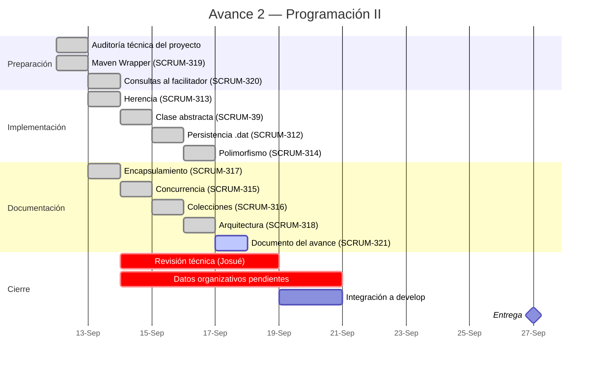
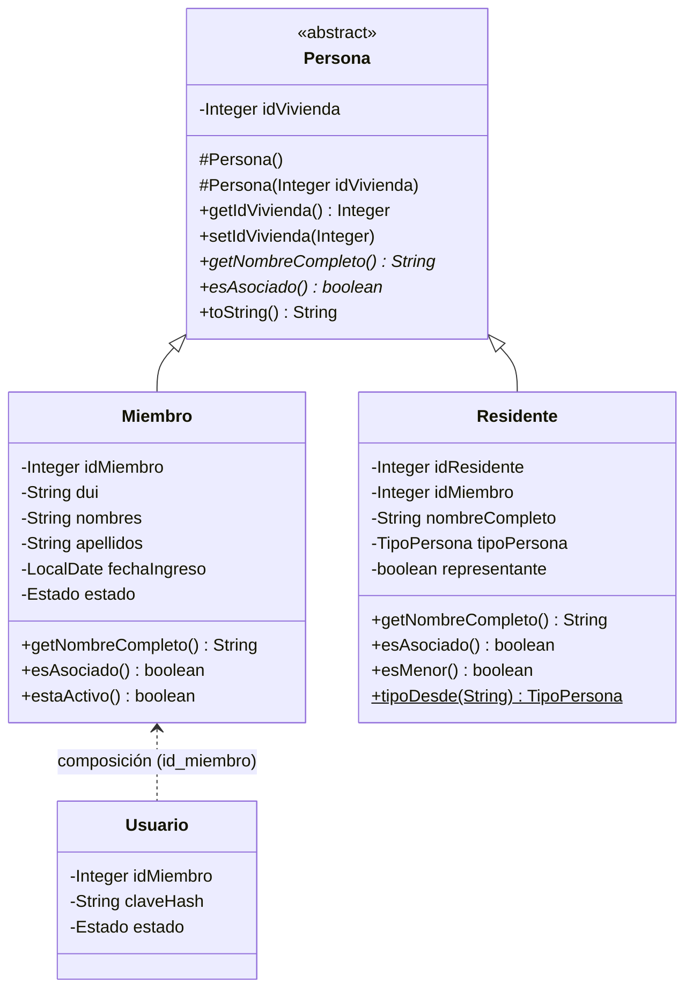

# Avance 2 — Sistema de Gestión de Asociación Comunal

**Programación II · Universidad**
**Rama de trabajo:** `isolated/advance2-compliance-and-fixes`
**Épica Jira:** SCRUM-310 · **Ticket de este documento:** SCRUM-321
**Fecha del corte técnico:** 13 de septiembre de 2026
**Entrega:** 27 de septiembre de 2026

> **Estado del documento: FUENTE MANTENIBLE, NO ENTREGABLE FINAL.**
> Este archivo consolida el estado técnico real y verificado del proyecto. Las secciones marcadas **`[PENDIENTE MANUAL]`** dependen de información organizativa que **no existe en el repositorio** y que debe completarla el equipo. **No se inventó ningún dato para rellenarlas.**
> Antes de generar el PDF o el Word de entrega, resolver todos los `[PENDIENTE MANUAL]`.

---

## Índice

| # | Apartado | Estado |
|---:|---|---|
| 1 | Portada | `[PENDIENTE MANUAL]` |
| 2 | Objetivo general | Borrador, requiere confirmación |
| 3 | Objetivos específicos del Avance 2 | Completo |
| 4 | Distribución del equipo Scrum | `[PENDIENTE MANUAL]` parcial |
| 5 | Roles y funciones del sistema | Completo, derivado del código |
| 6 | Requerimientos e historias de usuario | `[PENDIENTE MANUAL]` |
| 7 | Alcances, limitaciones y límites | Completo |
| 8 | Planificación: actividad, responsable, fecha | Completo |
| 9 | Cronograma (diagrama de Gantt) | Completo |
| 10 | Entradas y salidas del sistema | Parcial (alcance del Avance 2) |
| 11 | Declaración de entidades del sistema | Completo |
| 12 | **Evidencia técnica: criterios 1 a 12 de la rúbrica** | **Completo** |
| 13 | Estrategia de versionamiento y trazabilidad | Completo |
| 14 | Conclusiones | Completo |
| 15 | Bibliografía | Borrador |
| — | Anexo A: trabajo pendiente para hardening | Completo |
| — | Anexo B: datos pendientes de completar | Completo |

---

## Nota sobre las fuentes de este documento

Todo lo que se afirma aquí proviene de una de estas fuentes, **verificadas el 13 de septiembre de 2026**:

| Fuente | Qué aporta |
|---|---|
| Código de `isolated/advance2-compliance-and-fixes` | Clases, líneas, comportamiento |
| `docs/avance2/encapsulamiento.md` (SCRUM-317) | Criterio 2 |
| `docs/avance2/concurrencia.md` (SCRUM-315) | Criterio 5 |
| `docs/avance2/colecciones.md` (SCRUM-316) | Criterio 7 |
| `docs/avance2/arquitectura.md` (SCRUM-318) | Criterio 8 |
| Ejecuciones de `./mvnw -B -ntp clean test` | Progresión de pruebas |
| Comentario del 13-sep-2026 en SCRUM-320 | Decisiones del facilitador |
| Historial de `git log` y PR #28 | Trazabilidad |

**El PDF oficial de la guía del Avance 2 no está versionado en el repositorio.** La rúbrica y la lista de apartados que se usan aquí están transcritas del análisis registrado en `Planificacion_Tecnica_Avance2.pdf` y en la descripción de SCRUM-321. Antes de la entrega conviene cotejar ambas contra el PDF original.

---

# 1. Portada

`[PENDIENTE MANUAL]`

La guía exige portada con **fotografía, nombre completo, CIF y participación (SÍ/NO)** de cada integrante.

Esta información **no está en el repositorio** y no puede derivarse del código ni del historial de Git. El equipo debe completar:

| Campo | Estado |
|---|---|
| Fotografías de los 8 integrantes | `[PENDIENTE MANUAL]` |
| Nombres completos | `[PENDIENTE MANUAL]` — solo constan dos (§4) |
| CIF de cada integrante | `[PENDIENTE MANUAL]` |
| Columna «¿Participó? SÍ/NO» | `[PENDIENTE MANUAL]` — **ver la advertencia de §4** |

> **Advertencia sobre la columna de participación.** El historial del repositorio registra **dos autores en las 31 ramas**. Declarar participación de los ocho integrantes sería inconsistente con la evidencia que el propio repositorio expone y que el facilitador puede revisar. Esta decisión corresponde al equipo, no a este documento; se señala porque es un riesgo real para el criterio 10.

---

# 2. Objetivo general

> **Borrador — confirmar contra el objetivo general del Avance 1.**

Desarrollar un sistema de información multiplataforma que permita a una asociación comunal salvadoreña administrar su padrón de asociados, su junta directiva, sus proyectos comunitarios, sus aportaciones económicas, sus asambleas y sus procesos de votación, aplicando los principios de la programación orientada a objetos y una arquitectura por capas que permita su evolución y su eventual uso en un entorno productivo.

`[PENDIENTE MANUAL]` — El objetivo general del Avance 1 debe transcribirse literalmente si se opta por presentar este avance como evolución del anterior y no como documento nuevo.

---

# 3. Objetivos específicos del Avance 2

Estos sí se redactan para este avance, y corresponden exactamente al trabajo ejecutado:

1. **Evolucionar el diseño de clases** del Avance 1 incorporando una jerarquía de dominio con clase base abstracta, sin romper la funcionalidad existente.
2. **Incorporar persistencia mediante archivos `.dat`** como origen de datos real, coexistiendo con la persistencia JDBC/MySQL ya construida, conforme a la decisión del facilitador registrada en SCRUM-320.
3. **Demostrar polimorfismo efectivo** haciendo que una capa de servicio opere indistintamente sobre dos implementaciones del mismo contrato de acceso a datos.
4. **Introducir una segunda abstracción**, independiente de la del dominio, que concentre el comportamiento común de la persistencia en archivos.
5. **Documentar y justificar técnicamente** la concurrencia, las colecciones, el encapsulamiento y la arquitectura por capas que el sistema ya implementaba, con evidencia de código concreta.
6. **Establecer una compilación reproducible** y una línea base de pruebas verificable desde un clon limpio del repositorio.
7. **Versionar el documento del avance dentro del repositorio**, como exige la guía.
8. **Mantener la trazabilidad** entre cada requisito de la rúbrica, su ticket de Jira, su commit y sus pruebas.

---

# 4. Distribución del equipo Scrum

| Rol Scrum | Integrante | Evidencia |
|---|---|---|
| **Scrum Master** | Carlos Samayoa | Reportero de la épica SCRUM-310 y de los 12 tickets del avance |
| **Desarrollador (implementación del Avance 2)** | Carlos Samayoa | Autor de los 9 commits de la rama |
| **Revisor técnico** | Josué Jeremías Castillo Nieves | Asignado en los 9 tickets en *Technical Review* |
| **Desarrollador (base del proyecto)** | Josué Jeremías Castillo Nieves (`MiasCN`) | 96 commits en el repositorio |
| **Desarrollador (aportes puntuales)** | Gerson Bermúdez (`G3rze`) | 2 commits: `ff88470` y `49f0229` |
| **Coordinador designado** | `[PENDIENTE MANUAL]` | La guía exige designarlo explícitamente |
| Integrantes restantes | `[PENDIENTE MANUAL]` | Sin registro en el repositorio ni en Jira |

`[PENDIENTE MANUAL]` — Nombres completos, CIF y rol Scrum de los integrantes no listados. **No se inventan.**

---

# 5. Roles y funciones del sistema

Derivado del código, no del documento anterior. Fuente: `RolService.ROLES_BASE` (`RolService.java:13`) y `AuthService.SYSTEM_ROLES` (`api/auth/AuthService.java:13`).

```java
public static final Set<String> ROLES_BASE = Set.of(
    "ADMIN", "ADMINISTRADOR", "PRESIDENTE", "SECRETARIO", "TESORERO", "SINDICO", "MIEMBRO"
);
```

| Rol | Funciones principales en el sistema |
|---|---|
| **ADMIN / ADMINISTRADOR** | Gestión de usuarios, roles y catálogos; acceso a la bitácora de auditoría |
| **PRESIDENTE** | Gestión de la junta directiva, periodos, proyectos y convocatorias |
| **SECRETARIO** | Padrón de miembros, viviendas y residentes; reuniones y pase de lista |
| **TESORERO** | Aportaciones, control de morosidad y estado económico de proyectos |
| **SÍNDICO** | Supervisión; procesos de votación |
| **MIEMBRO** | Consulta de su propia información; emisión de voto en votaciones abiertas |
| **DIRECTIVO** | Rol adicional reconocido por la autenticación (`SYSTEM_ROLES`) |

La comprobación de rol es transversal y se aplica en `AuthorizationService.requireAnyRole(principal, Set<String>)` (`AuthorizationService.java:6`), no repartida por los controladores.

---

# 6. Requerimientos e historias de usuario

`[PENDIENTE MANUAL]`

El Avance 1 declara **15 historias de usuario**. **Ese listado no está versionado en el repositorio** — no existe ningún archivo con historias de usuario en `docs/` ni en la raíz.

Lo que sí puede afirmarse, porque se verificó en el código, es **qué módulos están construidos y operativos**:

| Módulo | Rutas REST | Cliente de escritorio |
|---|---|---|
| Autenticación y sesiones | `/api/admin/auth/login`, `/api/auth/*` | Pantalla de login con bloqueo por intentos |
| Miembros (padrón) | 5 rutas (`GET`, `POST`, `PUT`, `PATCH` estado) | Módulo completo con filtro y alta/baja |
| Viviendas y residentes | 5 rutas | Módulo completo |
| Usuarios y roles | 10 rutas | Módulos completos |
| Aportaciones | 5 rutas, con paginación y totales | Módulo completo |
| Proyectos | 6 rutas | Módulo completo con ciclo de vida |
| Cargos y periodos de directiva | 14 rutas | Módulos completos |
| Asignaciones de cargo / directiva | 8 rutas | Módulo completo |
| Votaciones y opciones | 12 rutas | Módulo completo con papeleta y reordenamiento |
| Reuniones y asistencias | 6 rutas | Módulo completo con pase de lista |
| Bitácora de auditoría | 2 rutas | Módulo de consulta |
| Actualizaciones de cliente | 9 rutas | Actualizador automático |

**Total: ~90 rutas REST, 33 vistas FXML, 35 controladores de escritorio.**

`[PENDIENTE MANUAL]` — Transcribir las 15 HU del Avance 1 y marcar cuáles quedaron cubiertas, cuáles cambiaron y cuáles se añadieron después (viviendas/residentes y la aplicación Android no estaban en el alcance declarado del Avance 1).

---

# 7. Alcances, limitaciones y límites

> **Corrección respecto al Avance 1.** El documento anterior declara la aplicación móvil **fuera de alcance**, y sí se construyó. Esta sección refleja lo realmente entregado.

## 7.1 Alcance del sistema

**Incluye:**
- Aplicación de escritorio JavaFX para el personal administrativo (33 vistas).
- API REST en Java 21 + Javalin, con autenticación JWT (~90 rutas).
- Persistencia en MySQL vía JDBC, con 17 tablas.
- **Persistencia en archivos `.dat` mediante serialización de Java** (incorporada en este avance).
- Aplicación Android para residentes, con sesiones opacas.
- Mecanismo de actualización automática del cliente de escritorio.
- Bitácora de auditoría automática de toda operación de escritura.

## 7.2 Alcance específico del Avance 2

Este avance **no añadió funcionalidad de negocio nueva**. Lo entregado es:

- Jerarquía de dominio `Persona → Miembro / Residente`.
- Abstracción de persistencia en archivos `AbstractArchivoDAO<T,ID>` y su implementación `MiembroArchivoDAO`.
- Servicio de consulta `CensoMiembrosService` que demuestra polimorfismo.
- Compilación reproducible mediante Maven Wrapper.
- Cuatro documentos de evidencia técnica más este documento.

## 7.3 Limitaciones declaradas — estado real, sin adornos

Estas limitaciones son **decisiones conscientes**, no omisiones. Se declaran porque presentarlas de otro modo sería incorrecto:

1. **No existe sincronización entre MySQL y `.dat`.** Son dos orígenes de datos independientes. Lo que se guarda en uno no aparece en el otro. No se implementó sincronización porque no fue solicitada y porque introducirla sin una estrategia de resolución de conflictos sería peor que no tenerla.
2. **La producción no cambia automáticamente a `.dat`.** `ApiServer.java:45` inyecta la implementación JDBC. La de archivo se ejercita en las pruebas. **El sistema no funciona sin conexión**; lo que se demuestra es que la capa de servicio no depende de cuál implementación esté conectada.
3. **La persistencia en archivos cubre la entidad `Miembro`.** `AbstractArchivoDAO<T,ID>` es genérica y admite cualquier entidad serializable, pero solo se implementó `MiembroArchivoDAO`.
4. **`AbstractArchivoDAO` reescribe el archivo completo en cada operación de escritura.** Es adecuado para el volumen de una asociación comunal (decenas de registros), no para volúmenes grandes.
5. **Los identificadores del DAO de archivo se generan como `máx + 1`.** Si se elimina el último registro, su identificador puede reutilizarse. Está documentado en el Javadoc de la clase y cubierto por una prueba que lo describe explícitamente.
6. **`Usuario` no forma parte de la jerarquía `Persona`.** Ver §12, criterio 3, para la justificación de diseño.
7. **Una prueba falla por causa ambiental**, preexistente a este avance. Ver §12, criterio 11.

---

# 8. Planificación: actividad, responsable y fecha

Planificación **real y verificable**, reconstruida del historial de Git y de Jira. Todas las fechas son de ejecución efectiva.

| # | Actividad | Ticket | Responsable | Fecha | Commit |
|---:|---|---|---|---|---|
| 0 | Auditoría técnica del estado del proyecto | — | Carlos Samayoa | 12-sep-2026 | — |
| 1 | Consultas de alcance al facilitador | SCRUM-320 | Carlos Samayoa | 13-sep-2026 | — |
| 2 | Compilación reproducible (Maven Wrapper) | SCRUM-319 | Carlos Samayoa | 12-sep-2026 | `68b8c88` |
| 3 | Jerarquía `Persona → Miembro / Residente` | SCRUM-313 | Carlos Samayoa | 13-sep-2026 | `6640d6d` |
| 4 | Clase abstracta `AbstractArchivoDAO<T,ID>` | SCRUM-39 | Carlos Samayoa | 13-sep-2026 | `475046a` |
| 5 | Persistencia `.dat` (`MiembroArchivoDAO`) | SCRUM-312 | Carlos Samayoa | 13-sep-2026 | `3a86806` |
| 6 | Polimorfismo (`CensoMiembrosService`) | SCRUM-314 | Carlos Samayoa | 13-sep-2026 | `0d349dd` |
| 7 | Evidencia de encapsulamiento | SCRUM-317 | Carlos Samayoa | 13-sep-2026 | `7fbb114` |
| 8 | Justificación de concurrencia | SCRUM-315 | Carlos Samayoa | 13-sep-2026 | `4446d45` |
| 9 | Justificación de colecciones | SCRUM-316 | Carlos Samayoa | 13-sep-2026 | `a075efc` |
| 10 | Documentación de arquitectura por capas | SCRUM-318 | Carlos Samayoa | 13-sep-2026 | `448767d` |
| 11 | **Documento del Avance 2 (este archivo)** | SCRUM-321 | Carlos Samayoa | 13-sep-2026 | — |
| 12 | Revisión técnica de los 10 tickets | — | Josué J. Castillo | `[PENDIENTE]` | — |
| 13 | Integración a `develop` y entrega | — | Equipo | `[PENDIENTE]` | — |

**Responsable de la revisión:** los 10 tickets están en estado *Technical Review* asignados a Josué Jeremías Castillo Nieves. La revisión aún no se ha ejecutado.

---

# 9. Cronograma — diagrama de Gantt



> **Lectura honesta del cronograma:** la implementación y la documentación técnica se concentraron en dos días porque el sistema ya estaba construido y este avance consistió en **evolucionarlo y evidenciarlo**, no en desarrollarlo desde cero. Lo que queda en la ruta crítica no es código: es la revisión técnica y la información organizativa del §1, §4 y §6.

---

# 10. Entradas y salidas del sistema

Se documentan las operaciones **afectadas por el Avance 2**. El resto de módulos conserva las entradas y salidas del Avance 1.

## 10.1 Consulta del padrón de miembros — `GET /api/miembros`

| | |
|---|---|
| **Entrada** | Cabecera `Authorization: Bearer <jwt>`. Sin cuerpo. |
| **Proceso** | `MiembroController.getAll` → `CensoMiembrosService.findAll()` → `DAO<Miembro,Integer>.findAll()` |
| **Salida** | `200` + arreglo JSON de `MiembroResponse` |
| **Errores** | `401` token inválido o expirado |

Campos de salida (`MiembroResponse.java:5`): `id`, `dui`, `tipoDocumento`, `paisOrigen`, `idVivienda`, `nombres`, `apellidos`, `telefono`, `correo`, `direccion`, `fechaIngreso`, `estado`.

## 10.2 Consulta de un miembro — `GET /api/miembros/{id}`

| | |
|---|---|
| **Entrada** | `id` en la ruta + token |
| **Salida** | `200` + `MiembroResponse`, o `404` con `{"error":"Miembro no encontrado."}` |

## 10.3 Cambio de estado de un miembro — `PATCH /api/miembros/{id}/estado`

| | |
|---|---|
| **Entrada** | `id` en la ruta + `{"estado":"ACTIVO"\|"INACTIVO"}` + token |
| **Proceso** | Validación del estado en `MiembroService.changeState:63`; **transacción sobre `miembro` y `usuario`** en `MiembroDAO.changeEstado:131` |
| **Salida** | `200` + `MiembroResponse` actualizado |
| **Errores** | `400` estado inválido · `404` miembro inexistente |
| **Efecto lateral** | Registro automático en `bitacora` (`ApiServer.java:196`) |

## 10.4 Persistencia en archivo — `MiembroArchivoDAO`

No es una ruta HTTP: es una implementación del contrato de datos.

| | |
|---|---|
| **Entrada** | Objeto `Miembro` (serializable) |
| **Almacenamiento** | `datos/miembros.dat`, o la ruta indicada por `DATOS_DIR` |
| **Formato** | Serialización nativa de Java (`ObjectOutputStream`) de una `List<Miembro>` |
| **Salida** | `List<Miembro>` / `Optional<Miembro>`, idénticas a las del DAO JDBC |

---

# 11. Declaración de entidades del sistema

## 11.1 Tablas (17)

Definidas en `schema.sql` (14) y en `database/migrations/` (3).

| Tabla | Origen | Propósito |
|---|---|---|
| `rol` | `schema.sql` | Catálogo de roles |
| `miembro` | `schema.sql` | Padrón de asociados |
| `usuario` | `schema.sql` | Credenciales y estado de cuenta |
| `cargo` | `schema.sql` | Catálogo de cargos directivos |
| `periodo_directiva` | `schema.sql` | Periodos de la junta directiva |
| `miembro_cargo` | `schema.sql` | Asignación de cargo a miembro en un periodo |
| `aportacion` | `schema.sql` | Aportaciones económicas |
| `proyecto` | `schema.sql` | Proyectos comunitarios |
| `votacion` | `schema.sql` | Procesos de votación |
| `opcion_votacion` | `schema.sql` | Alternativas de una papeleta |
| `voto` | `schema.sql` | Voto emitido |
| `reunion` | `schema.sql` | Asambleas y reuniones |
| `asistencia` | `schema.sql` | Pase de lista |
| `bitacora` | `schema.sql` | Auditoría de operaciones |
| `sesion_usuario` | `V002` | Sesiones y tokens de refresco |
| `vivienda` | `V005` | Viviendas de la comunidad |
| `residente_vivienda` | `V005` | Personas que habitan una vivienda |

### Restricciones de integridad destacadas

| Restricción | Tabla | Qué garantiza |
|---|---|---|
| `uk_voto_votacion_miembro` | `voto` | **Un solo voto por miembro y votación** |
| `uk_aportacion_miembro_periodo` | `aportacion` | Una aportación por miembro y periodo |
| `uk_asistencia_reunion_miembro` | `asistencia` | Un registro de asistencia por reunión y miembro |
| `uq_sesion_access_token` | `sesion_usuario` | Unicidad del token de acceso |

## 11.2 Clases de entidad en Java (17)

`api/src/main/java/sv/asociacion/domain/entity/`

| Clase | Tabla | Nota |
|---|---|---|
| **`Persona`** | — | **Abstracta. No tiene tabla: es la base del dominio.** Añadida en SCRUM-313 |
| `Miembro` | `miembro` | **`extends Persona`** |
| **`Residente`** | `residente_vivienda` | **`extends Persona`.** Añadida en SCRUM-313 |
| `Usuario` | `usuario` | **No hereda de `Persona`** — ver §12, criterio 3 |
| `Vivienda` | `vivienda` | |
| `Rol` | `rol` | |
| `Cargo` | `cargo` | |
| `PeriodoDirectiva` | `periodo_directiva` | |
| `MiembroCargo` | `miembro_cargo` | |
| `Aportacion` | `aportacion` | |
| `Proyecto` | `proyecto` | |
| `Votacion` | `votacion` | |
| `OpcionVotacion` | `opcion_votacion` | |
| `Voto` | `voto` | |
| `Reunion` | `reunion` | |
| `Asistencia` | `asistencia` | |
| `Bitacora` | `bitacora` | |

`sesion_usuario` no tiene clase en `domain.entity`: la gestiona el paquete `api.auth` con sus propios repositorios.

## 11.3 Jerarquía de dominio introducida en este avance



---

# 12. Evidencia técnica — criterios 1 a 12 de la rúbrica

Ponderación total: **10 puntos**. Para cada criterio: clase o archivo, comportamiento, ticket, commit, pruebas y justificación.

---

## Criterio 1 — Evolución del primer avance y diseño de clases · 0.50 pts

| | |
|---|---|
| **Archivos** | `Persona.java`, `Residente.java`, `Miembro.java`, `AbstractArchivoDAO.java`, `MiembroArchivoDAO.java`, `CensoMiembrosService.java` |
| **Tickets** | SCRUM-313, SCRUM-39, SCRUM-312, SCRUM-314 |
| **Commits** | `6640d6d`, `475046a`, `3a86806`, `0d349dd` |
| **Pruebas** | 45 pruebas nuevas (10 + 10 + 14 + 11) |

**Evolución medible respecto al Avance 1:**

| Dimensión | Avance 1 (`777ba35`) | Avance 2 | Δ |
|---|---:|---:|---:|
| Clases de entidad | 15 | **17** | +2 |
| Jerarquías de herencia en el dominio | 0 | **1** | +1 |
| Clases abstractas propias | 0 | **2** | +2 |
| Implementaciones del contrato `DAO<T,ID>` por entidad | 1 | **2** | +1 |
| Servicios que dependen del contrato genérico | 0 | **1** | +1 |
| Pruebas automatizadas | 144 | **189** | +45 |
| Compilación reproducible | No | **Sí** | — |

**Justificación técnica.** La evolución **no consistió en añadir funcionalidad**, sino en corregir dos debilidades estructurales reales del diseño anterior: (a) no existía ninguna abstracción de dominio, de modo que `Miembro` y las futuras entidades de persona no compartían contrato; y (b) el único `DAO` genérico tenía una sola implementación por entidad, por lo que el polimorfismo era teórico. Ambas se resolvieron sin modificar el comportamiento observable del sistema — lo prueba que las 144 pruebas originales siguen pasando.

---

## Criterio 2 — Encapsulamiento · 0.70 pts

| | |
|---|---|
| **Documento** | `docs/avance2/encapsulamiento.md` (243 líneas) |
| **Ticket** | SCRUM-317 · **Commit** `7fbb114` |
| **Medición** | **17 clases de entidad · 106 campos `private` · 0 campos `public`** |

**Evidencia seleccionada:**

| Caso | Archivo | Qué encapsula |
|---|---|---|
| `enum Estado` en `Miembro` | `Miembro.java` | Hace **imposible** un estado inválido; con `String`, `"ACITVO"` compilaría |
| `getNombreCompleto()` calculado | `Miembro.java` | No se almacena: no puede desincronizarse de `nombres`/`apellidos` |
| `idVivienda` privado en `Persona` | `Persona.java:27` | **Privado incluso para las subclases**; constructores `protected` |
| `Residente.esAsociado()` | `Residente.java:70` | La regla «es asociado si tiene ficha de miembro» vive en **un solo lugar** |
| `PasswordHasher` | `PasswordHasher.java` | **5 de 7 métodos privados** + constructor privado; el algoritmo queda encerrado |
| `SessionManager.requireToken()` | `SessionManager.java:34` | Falla con mensaje claro en vez de devolver `null` |
| `AbstractArchivoDAO` | Tres niveles de visibilidad | `private` la ruta, `protected final` la E/S, `protected abstract` la extensión |
| `CensoMiembrosService` | `CensoMiembrosService.java:28` | **No existe `getOrigen()`**: la implementación no se filtra |

**Justificación técnica.** El encapsulamiento del proyecto **ya era correcto antes de este avance**; el trabajo consistió en localizarlo y explicarlo, no en producirlo. La prueba `CensoMiembrosServiceTest.sinCastsNiInstanceof()` verifica automáticamente que ningún método del servicio devuelva el `DAO`.

---

## Criterio 3 — Herencia · 0.80 pts

| | |
|---|---|
| **Archivos** | `Persona.java` (nuevo), `Residente.java` (nuevo), `Miembro.java` (modificado) |
| **Ticket** | SCRUM-313 · **Commit** `6640d6d` |
| **Pruebas** | `PersonaJerarquiaTest` — **10 pruebas** |

```java
public abstract class Persona implements Serializable {
    private Integer idVivienda;                       // línea 27
    protected Persona() { }                           // línea 29
    protected Persona(Integer idVivienda) { ... }     // línea 31
    public abstract String getNombreCompleto();       // línea 42
    public abstract boolean esAsociado();             // línea 49
}
```

**Jerarquía real:** `Persona` → `Miembro` y `Persona` → `Residente`.

**Por qué `Residente` y no otra clase.** `residente_vivienda` (migración `V005`) ya existía y modela a las personas que habitan una vivienda: hijos, inquilinos, familiares. Su columna `id_miembro` es **nullable** — vivir en la vivienda no implica ser asociado. Es el segundo tipo de persona real del dominio, no una clase inventada para justificar la herencia. **No se modificó el esquema de la base de datos** para crearla.

**Por qué `Usuario` NO hereda de `Persona`.** Es una decisión de diseño deliberada, y decir lo contrario sería incorrecto: `Usuario` **no es una persona**, es una **credencial de acceso**. Contiene `claveHash`, `estado` de cuenta y `id_miembro`. La relación con la persona es de **composición** (una cuenta pertenece a un miembro), no de herencia. Forzar `Usuario extends Persona` significaría que una cuenta tiene nombre completo y vivienda, lo cual es falso.

**Qué se subió a la clase base, y qué no.** Solo `idVivienda`, porque es el único atributo que **ambas** subclases comparten con el mismo significado. `dui`, `nombres`, `apellidos` y `fechaIngreso` se quedaron en `Miembro`: `Residente` guarda un único `nombreCompleto` y no tiene documento propio. Subir campos que una subclase no usa habría producido una jerarquía aparente con la mitad de los atributos en `null`.

---

## Criterio 4 — Polimorfismo · 0.80 pts

| | |
|---|---|
| **Archivo** | `CensoMiembrosService.java` (nuevo, 43 líneas) |
| **Ticket** | SCRUM-314 · **Commit** `0d349dd` |
| **Pruebas** | `CensoMiembrosServiceTest` — **11 pruebas**, 3 de ellas `@ParameterizedTest` sobre ambas implementaciones |

```java
public class CensoMiembrosService {
    private final DAO<Miembro, Integer> origen;       // línea 28 — el contrato, no la implementación

    public List<MiembroResponse> findAll() {
        return origen.findAll().stream().map(MiembroResponse::from).toList();
    }
}
```

```
                   CensoMiembrosService
                            │
                   DAO<Miembro,Integer>
                   ╱                  ╲
            MiembroDAO          MiembroArchivoDAO
            JDBC / MySQL              .dat
```

**Despacho dinámico demostrado, no afirmado.** La misma lógica se ejecuta contra dos implementaciones distintas y produce resultados **idénticos**:

```java
@Test
void ambasRamasProducenElMismoResultado() {
    assertEquals(desdeMySql.findAll(), desdeArchivo.findAll(),
        "el padron debe ser indistinguible entre una fuente y otra");
}
```

**Verificaciones automáticas adicionales:**
- `elServicioDependeSoloDelContrato()` — por reflexión: el servicio tiene **un único campo** y su tipo es `DAO`, no `MiembroDAO`.
- `sinCastsNiInstanceof()` — ninguna firma menciona una implementación concreta y **ningún método devuelve el `DAO`**.

**Por qué un servicio nuevo y no `MiembroService`.** `MiembroService` depende de comportamiento que **solo existe en la implementación JDBC**: `existsByDui`, `existsByDuiExcludingId` y, sobre todo, `changeEstado`, que ejecuta una transacción sobre `miembro` y `usuario`. Un archivo `.dat` no tiene equivalente transaccional. Forzar `MiembroService` a depender del contrato genérico habría exigido ampliar `DAO<T,ID>` con métodos que la implementación de archivo no puede cumplir honestamente — polimorfismo aparente. La solución fue un servicio **de solo lectura** que se limita a lo que el contrato realmente ofrece.

---

## Criterio 5 — Programación concurrente · 1.20 pts

| | |
|---|---|
| **Documento** | `docs/avance2/concurrencia.md` (335 líneas) |
| **Ticket** | SCRUM-315 · **Commit** `4446d45` |
| **Decisión del facilitador** | *«No es necesario implementar una operación nueva; se debe justificar y documentar técnicamente la concurrencia que ya existe»* (SCRUM-320, 13-sep-2026) |

**Inventario medido sobre `src/main/java`:**

| Mecanismo | Ocurrencias |
|---|---:|
| `new Task<>` de JavaFX | 58 (en 24 controladores) |
| `new Thread(...)` | 55 |
| Hilos con nombre propio | 29 |
| `setDaemon(true)` | 33 |
| `Platform.runLater` | 9 |
| `ScheduledExecutorService` | 1 |
| `AtomicBoolean` / `volatile` | 3 |
| **`Thread.ofVirtual()` (Java 21)** | **3** |
| `synchronized` | 3 |

**Concurrencia ≠ paralelismo — y este sistema usa concurrencia.** Lo que se saca del hilo de interfaz es **espera de entrada/salida** (HTTP, MySQL, descarga), no cálculo. Repartir esa espera entre núcleos no la acorta. Lo que se gana es que **la aplicación no se congela**. El código lo respalda: **no existe `parallelStream` ni `ForkJoinPool` en ningún punto del proyecto**, y el planificador es explícitamente de un solo hilo. Afirmar aprovechamiento de múltiples núcleos sería falso.

**Casos documentados, en orden de solidez:**

1. **`UpdateService`** — el único que **no es plantilla del framework**: `ScheduledExecutorService` de **un solo hilo daemon con nombre** (`qa-update-scheduler`, línea 34), `STARTED.compareAndSet` para arranque único (línea 48), `CHECKING` como guardia contra comprobaciones solapadas **liberado en `finally`** (línea 107), `volatile lastOfferedVersion` por visibilidad (línea 32) e **hilos virtuales de Java 21** (líneas 70 y 123).
2. **`AsistenciasModalController.cargarDatos():164`** — el pase de lista en asamblea. `Task` + `setOnSucceeded`, que JavaFX garantiza ejecutar en el hilo de interfaz.
3. **`UpdateService.download():234`** — `Platform.runLater` con copia a variable efectivamente final (línea 242) para que el progreso corresponda al instante que representa.
4. **`VotoService.emitirVoto():32`** — `synchronized`, **con su límite explícito**: protege solo dentro de un proceso; la garantía real la da `uk_voto_votacion_miembro` (`schema.sql:172`).
5. **`DBConnection:31` / `DAOFactory:8`** — sincronización de la creación perezosa (*check-then-act*).

**Justificación técnica.** La concurrencia **no se añadió artificialmente para la rúbrica**: ya existía en `develop` (`777ba35`) al servicio de un problema real — el secretario no puede trabajar con la interfaz congelada durante una asamblea. Este avance la localizó, la midió y la justificó. **Cero archivos `.java` modificados** en este ticket.

---

## Criterio 6 — Clases abstractas · 0.60 pts

| | |
|---|---|
| **Archivo** | `AbstractArchivoDAO.java` (nuevo, 181 líneas) |
| **Ticket** | SCRUM-39 · **Commit** `475046a` |
| **Pruebas** | `AbstractArchivoDAOTest` — **10 pruebas**, con una entidad ajena (`Nota`) para probar la genericidad |

```java
public abstract class AbstractArchivoDAO<T extends Serializable, ID> implements DAO<T, ID> {
    private final Path archivo;                                    // línea 41

    protected abstract ID idDe(T entidad);                         // línea 52
    protected abstract void asignarIdentidad(T e, List<T> lista);  // línea 61

    protected final List<T> leerTodo();                            // línea 135
    protected final void escribirTodo(List<T> registros);          // línea 153
}
```

**El sistema tiene DOS abstracciones, no una, y son de naturaleza distinta:**

| | `Persona` | `AbstractArchivoDAO<T,ID>` |
|---|---|---|
| Capa | Dominio | Persistencia |
| Qué abstrae | Qué **es** una persona | Cómo se **guarda** una entidad |
| Genérica | No | **Sí** (`<T extends Serializable, ID>`) |
| Ticket | SCRUM-313 | SCRUM-39 |

**Justificación técnica del reparto de visibilidad** — tres niveles, cada uno elegido:
- **`private`** la ruta del archivo: las subclases la reciben por constructor y **no pueden cambiarla**.
- **`protected final`** `leerTodo()` y `escribirTodo()`: las subclases las **reutilizan** pero **no pueden redefinirlas**, así ninguna implementación rompe el formato del archivo.
- **`protected abstract`** los dos únicos puntos de extensión.

El resultado es medible: **`MiembroArchivoDAO` tiene solo 2 métodos de instancia**. Todo el CRUD lo hereda. Una segunda entidad serializable necesitaría la misma cantidad de código.

`AbstractArchivoDAOTest` prueba la clase base con una entidad **que no pertenece al dominio del proyecto** (`Nota`), lo que demuestra que la abstracción es genuinamente genérica y no está atada a `Miembro`.

---

## Criterio 7 — Colecciones · 0.80 pts

| | |
|---|---|
| **Documento** | `docs/avance2/colecciones.md` (428 líneas) |
| **Ticket** | SCRUM-316 · **Commit** `a075efc` |

**Inventario medido (`api` + `frontend`, `src/main/java`):**

| Estructura | Ocurrencias |
|---|---:|
| `List<...>` | 281 |
| `new ArrayList<>` | 61 |
| `Map<...>` | 31 |
| `new HashMap<>` | 16 |
| `Set<...>` | 3 |
| `Optional<...>` | 46 |
| `.stream()` | 78 |
| `ObservableList` / `FilteredList` (JavaFX) | 16 / 18 |

**Distinción técnica exigida — cuatro cosas que no son lo mismo:**

| | Qué es | Papel aquí |
|---|---|---|
| `Collection` (`List`, `Set`, `Map`) | Estructuras que **almacenan** | Padrón, papeleta, intentos de login |
| `Optional<T>` | **No es colección.** Contenedor de cero o un valor | Retorno de los `DAO` |
| `Stream<T>` | **No es colección.** No almacena, se consume una vez | Entidad → DTO |
| Arreglos `T[]` | Tamaño **fijo**, del lenguaje | Solo en la frontera con Jackson |

**Seis casos, en capas distintas:**

| Caso | Ubicación | Propiedad aprovechada |
|---|---|---|
| `List<T>` + `Optional<T>` en el contrato `DAO` | `DAO.java:7-8`, `MiembroDAO:12,28` | Crecimiento dinámico, orden, ausencia explícita |
| `ObservableList` + `FilteredList` | `MiembroController:56,57,69,411` | Notificación de cambios; vista sin copiar |
| `Collections.swap` en la papeleta | `OpcionesVotacionModalController:177-195` | **Orden posicional como dato del negocio** |
| `Set.of` de roles | `RolService:13`, `AuthService:13` | Unicidad, pertenencia, inmutabilidad |
| `Map` de intentos fallidos | `services/auth/AuthService:16-17,52-58` | Acceso por clave; clave como identidad |
| `List<T>` como unidad de trabajo | `AbstractArchivoDAO` | Acceso por índice; `Serializable` |

**El ejemplo más fuerte** es el tercero: al reordenar una papeleta **no se envía ningún campo de posición** al servidor — se envía una `List<Integer>` de identificadores y **el orden de esa lista *es* el orden nuevo**.

**Sobre las estructuras ausentes.** El proyecto **no usa** `HashSet`, `TreeMap`, `LinkedList`, `Queue`, `Deque` ni `EnumMap` — cero ocurrencias. Eso es coherente con el problema: la asociación maneja listados ordenados que se muestran en tabla y búsquedas por identificador que resuelve MySQL, no colas de trabajo ni índices ordenados en memoria. **Meter un `TreeMap` donde basta una `List` sería complicar el código para lucir variedad.**

**Justificación técnica.** Cinco de los seis casos **ya existían en `develop`**; el sexto (`AbstractArchivoDAO`) es de este avance y se sitúa deliberadamente al final del documento. Las colecciones son práctica establecida del sistema, no algo añadido para la rúbrica.

---

## Criterio 8 — Arquitectura por capas · 1.20 pts

| | |
|---|---|
| **Documento** | `docs/avance2/arquitectura.md` (603 líneas, 4 diagramas) |
| **Ticket** | SCRUM-318 · **Commit** `448767d` |

**Inventario de paquetes:**

```
api:       ApiServer 1 · controller 19 · service 19 · dao 17 · dao.archivo 2
           domain.entity 17 · domain.dto 44 · api.auth 16 · middleware 2
           config 3 · util 2
frontend:  app 2 · controller 35 · service 19 (14 *ApiClient) · models 19
           security 1 · services.auth 1 · + 33 vistas .fxml
```

**Reglas de dependencia — verificadas con `grep`, no declaradas:**

| Regla | Resultado |
|---|---|
| El frontend no toca la base de datos | **0 archivos** ✅ |
| Los DAO no importan servicios | **0** ✅ |
| Las entidades no importan DTO ni DAO | **0** ✅ |
| Los controladores HTTP no importan DAO | **1** ⚠️ (Anexo A) |

**Dos recorridos completos documentados:**

- **Lectura:** `frontend.MiembroController:375` → `MiembroApiClient:29` → `JwtAuthMiddleware:15` → `api.MiembroController:21` → `CensoMiembrosService:35` → `DAO<Miembro,Integer>` → `MiembroDAO:28` → MySQL.
- **Escritura:** `PATCH /api/miembros/{id}/estado`, con la **regla de negocio** en `MiembroService:63` y la **transacción** en `MiembroDAO:131`.

**El punto más fuerte para la defensa.** Dar de baja a un miembro toca **dos tablas**: `miembro` y `usuario`. Sin transacción quedaría alguien inactivo en el padrón **pero con la cuenta habilitada para entrar**. La transacción está **en el DAO y no en el servicio** porque es donde vive la `Connection`; subirla obligaría a la capa de negocio a manejar JDBC — justo lo que las capas existen para evitar.

**Capa transversal.** El interceptor `after("/api/*")` de `ApiServer:196` registra en bitácora solo escrituras y solo con respuesta 2xx, y excluye `/api/bitacoras` para no auditarse a sí misma. **Ningún controlador ni servicio contiene una línea de auditoría**: escribirla en cada método de escritura serían ~40 puntos que mantener sincronizados.

**`ApiServer` como raíz de composición.** Es el único punto donde se construyen las dependencias y el orden del `main` va de abajo hacia arriba. **No es Service Locator** (constructor privado, nadie le pide dependencias) **ni contenedor de inyección** (sin anotaciones ni reflexión). Existe `DAOFactory` en el código, pero `ApiServer` **no lo usa**.

**Separación Entity / DTO / Model.** Tres objetos con tres razones: `Miembro` (espejo de la tabla, con `LocalDate` y `enum`), `MiembroResponse` (contrato de la API, todo texto) y `MiembroModel` (lo que muestra JavaFX). El ejemplo que lo cierra: **`Usuario` tiene `claveHash`; su DTO no lo lleva.** Si la API devolviera entidades, publicaría hashes de contraseña.

---

## Criterio 9 — Persistencia mediante archivos `.dat` · 1.20 pts

| | |
|---|---|
| **Archivos** | `AbstractArchivoDAO.java`, `MiembroArchivoDAO.java` (87 líneas) |
| **Tickets** | SCRUM-39, SCRUM-312 · **Commits** `475046a`, `3a86806` |
| **Pruebas** | `AbstractArchivoDAOTest` (10) + `MiembroArchivoDAOTest` (14) = **24 pruebas** |
| **Decisión del facilitador** | **COEXISTENCIA**: *«MySQL y `.dat` pueden funcionar simultáneamente»* (SCRUM-320) |

**Mecanismo:** serialización nativa de Java. `Miembro implements Serializable` con `serialVersionUID`; la lista completa se escribe con `ObjectOutputStream` y se lee con `ObjectInputStream`.

**Configuración:**

| Constante | Valor |
|---|---|
| `NOMBRE_ARCHIVO` | `miembros.dat` |
| `CARPETA_POR_DEFECTO` | `datos` |
| `CLAVE_CARPETA` | `DATOS_DIR` (variable de entorno o propiedad del sistema) |

`datos/` y `*.dat` se añadieron a `.gitignore`: los datos no se versionan.

**Qué se puede afirmar y qué no** — esta distinción es la más importante del criterio:

| Afirmación | ¿Correcta? |
|---|---|
| `.dat` es persistencia **real**: lo guardado se recupera sin intervenir MySQL | ✅ Sí |
| Implementa el contrato completo `DAO<T,ID>` (CRUD) | ✅ Sí |
| Está cubierta por 24 pruebas automatizadas | ✅ Sí |
| **JDBC/MySQL sigue siendo el origen activo de producción** (`ApiServer:45`) | ✅ Sí |
| **No existe sincronización MySQL ↔ `.dat`** | ✅ Correcto afirmarlo |
| **La producción no cambia automáticamente a `.dat`** | ✅ Correcto afirmarlo |
| «El sistema funciona sin conexión gracias a `.dat`» | ❌ **Falso. No afirmarlo.** |

**Por qué no se cableó en producción.** Se evaluó añadir una variable `CENSO_ORIGEN=jdbc\|archivo` a `ApiServer` y **se descartó deliberadamente**: los dos orígenes no están sincronizados, de modo que conmutar el origen en caliente mostraría un padrón distinto sin aviso. Ofrecer un interruptor que produce datos inconsistentes es peor que no ofrecerlo.

**Limitación documentada honestamente.** Los identificadores se generan como `máx + 1`, de modo que al eliminar el último registro su identificador puede reutilizarse. Está en el Javadoc y **tiene una prueba dedicada que describe exactamente ese comportamiento**, en lugar de una prueba que afirme una garantía que el código no da.

---

## Criterio 10 — Versionamiento con Git · 1.00 pts

| | |
|---|---|
| **Rama** | `isolated/advance2-compliance-and-fixes`, desde `develop` = `777ba35` |
| **Commits** | 9, uno por ticket, todos con la clave de Jira |
| **PR** | **#28 «Avance 2 — Cumplimiento Programación II»**, Draft, hacia `develop` |
| **Ticket de soporte** | SCRUM-319 (Maven Wrapper y línea base) |

Ver §13 para el desarrollo completo de la estrategia.

**Requisito explícito de la guía:** *«deberán versionar el documento correspondiente al avance dentro de la raíz del proyecto»*. **Este documento y los cuatro de evidencia están versionados en `docs/avance2/`**, con su propio historial de commits.

`[PENDIENTE MANUAL]` — **Riesgo declarado:** el historial registra **dos autores** en las 31 ramas del repositorio. La guía valora la participación del equipo en el versionamiento. Esta es una situación de hecho que el documento no puede corregir y que el equipo debe decidir cómo presentar.

---

## Criterio 11 — Integración y funcionamiento del proyecto · 0.70 pts

| | |
|---|---|
| **Ticket** | SCRUM-319 · **Commit** `68b8c88` |
| **Herramienta** | Maven Wrapper 3.3.4, `distributionType=only-script`, Maven 3.9.16 |
| **Verificación** | Compilación probada **desde un clon limpio** del repositorio, con `./mvnw` y `.\mvnw.cmd` |

**Antes de este avance no existía compilación reproducible:** el proyecto requería tener Maven instalado globalmente. El wrapper se generó con la herramienta oficial y su distribución se verifica por URL versionada.

### Progresión de la línea base de pruebas

| Hito | Ticket | Ejecutadas | Correctas | Errores |
|---|---|---:|---:|---:|
| Línea base inicial | — | 144 | 143 | 1 |
| Herencia `Persona` | SCRUM-313 | 154 | 153 | 1 |
| Clase abstracta | SCRUM-39 | 164 | 163 | 1 |
| Persistencia `.dat` | SCRUM-312 | 178 | 177 | 1 |
| Polimorfismo | SCRUM-314 | **189** | **188** | **1** |
| Encapsulamiento (doc.) | SCRUM-317 | 189 | 188 | 1 |
| Concurrencia (doc.) | SCRUM-315 | 189 | 188 | 1 |
| Colecciones (doc.) | SCRUM-316 | 189 | 188 | 1 |
| Arquitectura (doc.) | SCRUM-318 | 189 | 188 | 1 |

**+45 pruebas. Ningún fallo lógico nuevo. Ninguna prueba existente rota.**

### Sobre el único error

`FxmlNavigationTest.cargaDashboardNavegaYCierraSesion` falla porque `ViviendaController` instancia `ViviendaApiClient` en su constructor, que llama a `QaApiConfig.load()`, que exige `QA_API_URL` + `QA_API_TOKEN` o un archivo `config/qa.properties` **deliberadamente no versionado porque contiene un token**.

**Es un error ambiental y preexistente**, no un defecto introducido por este avance: ya fallaba en la línea base de 144 pruebas. **Se conserva deliberadamente**: corregirlo implica cambiar cómo `ViviendaController` obtiene sus dependencias, lo cual es un cambio funcional que pertenece a la fase de hardening (SCRUM-311) y no al Avance 2.

Comando de verificación, ejecutable por cualquiera desde un clon limpio:

```bash
./mvnw -B -ntp clean test
```

---

## Criterio 12 — Documentación y presentación técnica · 0.50 pts

| | |
|---|---|
| **Entregables** | 5 documentos versionados en `docs/avance2/` |
| **Tickets** | SCRUM-317, SCRUM-315, SCRUM-316, SCRUM-318, SCRUM-321 |

| Documento | Líneas | Criterio | Commit |
|---|---:|---|---|
| `encapsulamiento.md` | 243 | 2 | `7fbb114` |
| `concurrencia.md` | 335 | 5 | `4446d45` |
| `colecciones.md` | 428 | 7 | `a075efc` |
| `arquitectura.md` | 603 | 8 | `448767d` |
| `AVANCE_2.md` (este) | — | 1–12 | SCRUM-321 |

**Cada documento contiene una sección «Cómo demostrarlo durante la defensa»** con 2 o 3 archivos concretos y el orden en que abrirlos. Esto responde directamente a la advertencia de la guía: *«se harán preguntas a miembros al azar para explicación de código»*.

`[PENDIENTE MANUAL]` — **Riesgo declarado.** La guía advierte que se preguntará a integrantes al azar. **El 98 % del código lo escribió una sola persona.** Las secciones de defensa de los cuatro documentos existen precisamente para repartir el conocimiento, pero **repartir el conocimiento requiere que los integrantes los estudien**; el documento no puede hacerlo por ellos. Se recomienda al menos una sesión de repaso conjunta antes de la defensa.

---

## Resumen de cobertura de la rúbrica

| # | Criterio | Pts | Evidencia | Estado |
|---:|---|---:|---|---|
| 1 | Evolución y diseño de clases | 0.50 | §12.1 · 4 tickets, 4 commits, 45 pruebas | ✅ |
| 2 | Encapsulamiento | 0.70 | `encapsulamiento.md` · 106 campos privados, 0 públicos | ✅ |
| 3 | Herencia | 0.80 | `Persona` → `Miembro`/`Residente` · 10 pruebas | ✅ |
| 4 | Polimorfismo | 0.80 | `CensoMiembrosService` · 11 pruebas sobre 2 implementaciones | ✅ |
| 5 | Programación concurrente | 1.20 | `concurrencia.md` · 5 casos con archivo y línea | ✅ |
| 6 | Clases abstractas | 0.60 | `AbstractArchivoDAO<T,ID>` · 10 pruebas con entidad ajena | ✅ |
| 7 | Colecciones | 0.80 | `colecciones.md` · 6 casos en capas distintas | ✅ |
| 8 | Arquitectura por capas | 1.20 | `arquitectura.md` · 2 recorridos, 4 diagramas | ✅ |
| 9 | Persistencia `.dat` | 1.20 | `MiembroArchivoDAO` · 24 pruebas | ✅ |
| 10 | Versionamiento con Git | 1.00 | §13 · 9 commits trazables, PR #28 | ⚠️ Ver riesgo de participación |
| 11 | Integración y funcionamiento | 0.70 | Maven Wrapper · 189/188/1 desde clon limpio | ✅ |
| 12 | Documentación y presentación | 0.50 | 5 documentos versionados | ⚠️ Ver riesgo de defensa |
| | **TOTAL** | **10.00** | | |

Los dos ⚠️ **no son huecos de evidencia técnica**: son riesgos organizativos declarados, no ocultados.

---

# 13. Estrategia de versionamiento y trazabilidad

## 13.1 Rama única de integración

Todo el Avance 2 se desarrolló en **`isolated/advance2-compliance-and-fixes`**, creada desde `develop` en `777ba35`.

**Por qué una sola rama y no una por ticket.** No es falta de disciplina, es una consecuencia de las dependencias reales entre los tickets:

```
SCRUM-313 (Persona)
     │
     ▼
SCRUM-39 (AbstractArchivoDAO)
     │
     ▼
SCRUM-312 (MiembroArchivoDAO)   ← necesita que Miembro sea Serializable (313)
     │
     ▼
SCRUM-314 (CensoMiembrosService) ← necesita DOS implementaciones del contrato (312)
     │
     ▼
SCRUM-317 / 315 / 316 / 318 / 321  ← documentan el resultado de todo lo anterior
```

`SCRUM-314` **no puede demostrar polimorfismo** si `SCRUM-312` no está integrado: necesita dos implementaciones del mismo contrato para comparar. Ramas separadas habrían obligado a fusionar continuamente entre ellas, produciendo un historial más confuso, no más limpio. Además, **los diez tickets componen un único entregable académico** que se integra o no se integra como un todo.

La disciplina se conserva donde importa: **un commit independiente por ticket**, cada uno con su clave de Jira, cada uno con su línea base de pruebas registrada.

## 13.2 Historial de la rama

| Commit | Fecha | Ticket | Descripción |
|---|---|---|---|
| `68b8c88` | 12-sep | SCRUM-319 | `build:` Maven Wrapper para compilación reproducible |
| `6640d6d` | 13-sep | SCRUM-313 | `feat:` jerarquía `Persona → Miembro / Residente` |
| `475046a` | 13-sep | SCRUM-39 | `feat:` abstracción base para persistencia en archivos |
| `3a86806` | 13-sep | SCRUM-312 | `feat:` persistencia de miembros en archivos `.dat` |
| `0d349dd` | 13-sep | SCRUM-314 | `feat:` consultar el censo a través del contrato `DAO<Miembro,Integer>` |
| `7fbb114` | 13-sep | SCRUM-317 | `docs:` evidencia de encapsulamiento |
| `4446d45` | 13-sep | SCRUM-315 | `docs:` justificación de concurrencia |
| `a075efc` | 13-sep | SCRUM-316 | `docs:` justificación de colecciones |
| `448767d` | 13-sep | SCRUM-318 | `docs:` arquitectura por capas |

## 13.3 Flujo de trabajo por ticket

Convención aplicada **sin excepción** a los 10 tickets:

1. Asignación a **Carlos Samayoa** y transición a *In Progress*.
2. Implementación o documentación **únicamente del alcance del ticket**.
3. Ejecución de la suite completa y **registro de la línea base como comentario en Jira**.
4. **Un commit independiente** con la clave del ticket en el mensaje.
5. `git push` a la rama de integración.
6. Transición a **Technical Review** y **reasignación a Josué Jeremías Castillo Nieves**.
7. **Ningún ticket se marcó `Done` directamente.** El flujo de Jira no admite `To-Do → Done`.

## 13.4 Estado de los tickets

| Ticket | Título | Estado | Asignado |
|---|---|---|---|
| SCRUM-319 | Maven Wrapper y línea base | Technical Review | Josué |
| SCRUM-313 | Jerarquía `Persona → Miembro` | Technical Review | Josué |
| SCRUM-39 | Clase abstracta reutilizable | Technical Review | Josué |
| SCRUM-312 | Persistencia en archivos `.dat` | Technical Review | Josué |
| SCRUM-314 | Polimorfismo vía `DAO<T,ID>` | Technical Review | Josué |
| SCRUM-317 | Evidencia de encapsulamiento | Technical Review | Josué |
| SCRUM-315 | Justificación de concurrencia | Technical Review | Josué |
| SCRUM-316 | Justificación de colecciones | Technical Review | Josué |
| SCRUM-318 | Arquitectura por capas | Technical Review | Josué |
| SCRUM-321 | Documento del Avance 2 | *en curso* | Carlos |
| SCRUM-320 | Consultas al facilitador | **Done** | — |

## 13.5 Pull Request y aislamiento de `develop`

**PR #28 — «Avance 2 — Cumplimiento Programación II»** · `isolated/advance2-compliance-and-fixes` → `develop`

| Campo | Valor |
|---|---|
| Estado | **Abierto** |
| Draft | **Sí** |
| Merged | **No** |
| Commits | 9 |
| Archivos modificados | 22 |

**`develop` permanece intacta en `777ba35`** desde antes de empezar este avance. No se hizo ningún merge, ningún cherry-pick y ningún push a `develop`. Verificación:

```bash
$ git merge-base --is-ancestor isolated/advance2-compliance-and-fixes develop
NO - sin merge
$ git rev-parse develop
777ba350497c6f667f96ffd50131078ad3731011
```

**Por qué el PR está en Draft.** El trabajo está completo pero **no revisado**. Marcarlo listo antes de la revisión de Josué contradiría el flujo acordado. La integración a `develop` es una decisión posterior a la revisión técnica.

## 13.6 Impacto sobre el cliente JavaFX

**El frontend permaneció prácticamente intacto durante todo el avance.** De los 22 archivos del PR, **ninguno pertenece a `frontend/src/main/java`**. Los cambios de código se concentraron en:

- `api/.../domain/entity/` — 3 archivos (2 nuevos, 1 modificado)
- `api/.../dao/archivo/` — 2 archivos nuevos
- `api/.../service/` — 1 archivo nuevo
- `api/.../controller/MiembroController.java` — constructor de 1 a 2 parámetros
- `api/.../ApiServer.java` — 2 líneas de composición
- `api/src/test/` — 4 archivos de prueba nuevos
- Raíz: `mvnw`, `mvnw.cmd`, `.mvn/wrapper/`, `.gitignore`
- `docs/avance2/` — 5 documentos

Esto es relevante para el criterio 11: **la aplicación de escritorio que se demostrará en la defensa es la misma que ya funcionaba**, y los cambios del avance no pudieron romperla porque no la tocaron.

---

# 14. Conclusiones

1. **El Avance 2 se resolvió evolucionando el sistema, no reescribiéndolo.** Las 144 pruebas del estado anterior siguen pasando y la aplicación de escritorio no se tocó. Los 45 casos nuevos cubren exclusivamente el código nuevo.

2. **Los tres bloqueos de alcance se resolvieron con el facilitador antes de escribir código**, no después (SCRUM-320, 13-sep-2026). Eso evitó dos riesgos concretos: desmontar la capa de datos para sustituirla por `.dat`, y una migración de Javalin a Spring Boot a dos semanas de la entrega.

3. **La persistencia `.dat` se implementó como coexistencia, no como sustitución**, conforme a la respuesta del facilitador. Es persistencia real y probada, pero **la producción sigue sobre MySQL y no hay sincronización entre ambos orígenes**. Declararlo así es más defendible que insinuar una capacidad que el sistema no tiene.

4. **El polimorfismo se demostró con una prueba que compara dos implementaciones**, no con una afirmación. `ambasRamasProducenElMismoResultado()` ejecuta la misma lógica contra MySQL y contra un archivo y verifica que los resultados sean indistinguibles.

5. **La concurrencia y las colecciones no se añadieron para la rúbrica: ya existían.** El trabajo consistió en medirlas y justificarlas con archivo y línea. En ambos casos se corrigieron los conteos que figuraban en Jira, porque eran estimaciones y no mediciones.

6. **Se distinguió explícitamente concurrencia de paralelismo.** El sistema usa concurrencia y no usa paralelismo, y el código lo respalda: no hay `parallelStream` ni `ForkJoinPool` en ningún punto. Afirmar aprovechamiento de múltiples núcleos habría sido falso y verificable en un minuto.

7. **La arquitectura por capas resistió la verificación automática.** De cuatro reglas de dependencia comprobadas con `grep`, tres se cumplen sin excepción y la cuarta tiene una sola violación en 19 controladores, que se documenta en lugar de disimularse.

8. **`develop` se mantuvo aislada durante todo el avance.** Sigue en `777ba35`. El PR #28 está en Draft esperando revisión técnica, no integración automática.

9. **El riesgo real de este avance no es técnico, es organizativo.** La evidencia de código está completa y verificable. Lo que falta es información que solo el equipo puede aportar: la portada, los integrantes, las historias de usuario y — sobre todo — que los integrantes conozcan el código que van a defender.

10. **Se identificaron seis hallazgos técnicos durante la documentación y ninguno se corrigió.** Corregirlos dentro de tickets documentales habría contaminado la evidencia y roto la trazabilidad entre ticket, commit y prueba. Quedan registrados para SCRUM-311 (Anexo A).

---

# 15. Bibliografía

> Borrador. Referencias efectivamente utilizadas durante el desarrollo y la documentación de este avance.

1. Oracle. *Java Platform, Standard Edition 21 API Specification.* `java.util.concurrent`, `java.io.Serializable`, `java.util.Optional`, `java.util.stream`.
2. Oracle. *JEP 444: Virtual Threads.* Java 21.
3. Oracle. *JavaFX 21 API Documentation.* `javafx.concurrent.Task`, `javafx.collections.ObservableList`, `javafx.collections.transformation.FilteredList`.
4. Javalin. *Javalin Documentation* — enrutamiento, `before`/`after` handlers, manejo de excepciones.
5. Oracle. *MySQL 8.0 Reference Manual* — motor InnoDB, restricciones `UNIQUE`, transacciones.
6. Apache Software Foundation. *Apache Maven Wrapper Documentation*, versión 3.3.4.
7. JUnit Team. *JUnit 5 User Guide* — `@ParameterizedTest`, `@MethodSource`, `@TempDir`.

`[PENDIENTE MANUAL]` — Añadir la bibliografía académica que el facilitador exija (libros de texto del curso, guías de la asignatura) y aplicar el formato de citación requerido (APA u otro).

---

# Anexo A — Hallazgos técnicos registrados para SCRUM-311

Durante la documentación de los criterios 5, 7 y 8 se detectaron **seis hallazgos reales**. **Ninguno se corrigió**, por decisión expresa: los tickets eran documentales y corregir dentro de ellos habría roto la trazabilidad entre ticket, commit y prueba.

| # | Hallazgo | Ubicación | Detectado en | Gravedad |
|---:|---|---|---|---|
| 1 | **22 de 55 hilos del cliente sin `setDaemon(true)`.** El proceso puede sobrevivir a la ventana hasta que expire un *timeout*. Cierre sucio, sin pérdida de datos. | `AsistenciasModalController`, `OpcionesVotacionModalController`, `ReunionesController`, `VotacionesController` y 3 más | SCRUM-315 | Baja |
| 2 | **Posible condición de carrera por doble clic en el pase de lista.** `toggleAsistenciaServidor` no desactiva la casilla mientras la petición viaja; dos clics generan dos peticiones sin orden garantizado y el `setOnFailed` revierte el valor visual. El mismo archivo ya aplica la mitigación correcta en `autoConvocar:211`. | `AsistenciasModalController:237,251` | SCRUM-315 | Media |
| 3 | **Consulta N+1 en el listado de votaciones.** Listar *V* votaciones con *M* opciones cuesta ~*V × (2+M)* consultas: 10 votaciones de 4 opciones ≈ 60 viajes a MySQL para una pantalla. Una consulta agrupada en un `Map<Integer,Integer>` lo reduce a 3. | `VotacionService:33,200` | SCRUM-316 | Media |
| 4 | **Mapas de bloqueo de login sin caducidad ni alcance estable.** `LoginController:44` crea `new AuthService()` como campo del controlador: si la pantalla se reconstruye, los mapas nacen vacíos y **el bloqueo de 30 s sería evitable**. | `services/auth/AuthService:16-17`, `LoginController:44` | SCRUM-316 | **Alta** (seguridad) |
| 5 | **`VotoController` depende directamente de `UsuarioDAO`**, saltando la capa de servicio, y lo repite en dos métodos. Única violación de la regla en 19 controladores. El campo además es opcional: según cómo se construya, la deducción del miembro no ocurre. | `VotoController:6,15,32,61` | SCRUM-318 | Media |
| 6 | **Dependencia oculta en `RolService`.** El constructor de conveniencia hace `this(rolDAO, new UsuarioDAO())`. Único `new ...DAO()` en `service/` o `controller/`. `ApiServer:49` usa el constructor completo, así que producción no pasa por ahí. | `RolService:21` | SCRUM-318 | Baja |

Además, **pendientes de la auditoría técnica previa** y del error ambiental:

| # | Pendiente | Ubicación |
|---:|---|---|
| 7 | `FxmlNavigationTest` falla por dependencia de `config/qa.properties` en el constructor de `ViviendaController` | `ViviendaController`, `QaApiConfig` |
| 8 | **README desactualizado:** afirma que el login de escritorio usa usuarios simulados. Ya no es cierto — `services/auth/AuthService` llama a `AuthApiClient.login()` contra la API real | `README.md` |

**Hallazgo 4 merece atención prioritaria** en la fase de hardening: es el único con implicación de seguridad.

---

# Anexo B — Datos pendientes de completar manualmente

Resumen de todo lo marcado `[PENDIENTE MANUAL]`. **Nada de esto se inventó.**

| # | Dato | Sección | Por qué no puede derivarse |
|---:|---|---|---|
| 1 | Fotografías, nombres completos y CIF de los 8 integrantes | §1 | No existe en el repositorio ni en Jira |
| 2 | Columna «¿Participó? SÍ/NO» | §1 | Decisión del equipo, con el riesgo de §12 criterio 10 declarado |
| 3 | Coordinador Scrum designado | §4 | La guía exige designarlo; no consta |
| 4 | Roles Scrum de los integrantes sin actividad registrada | §4 | Sin registro en Git ni en Jira |
| 5 | Objetivo general literal del Avance 1 | §2 | El PDF del Avance 1 no está versionado |
| 6 | Las 15 historias de usuario | §6 | **No existe ningún archivo de HU en el repositorio** |
| 7 | Bibliografía académica y formato de citación | §15 | Requisito del facilitador, no del código |
| 8 | Cotejo de la rúbrica y los apartados contra el PDF oficial | Nota de fuentes | **El PDF de la guía no está versionado en el repositorio** |
| 9 | Fecha real de la revisión técnica de Josué | §8 | Aún no ejecutada |

**Recomendación:** versionar el PDF oficial de la guía del Avance 2 dentro de `docs/avance2/` antes de generar el entregable final, para que el cotejo quede trazable.

---

## Control de versiones de este documento

| Versión | Fecha | Autor | Cambio |
|---|---|---|---|
| 1.0 | 13-sep-2026 | Carlos Samayoa | Versión inicial consolidada (SCRUM-321) |

**Estado:** fuente mantenible. **No generar PDF ni Word hasta resolver el Anexo B.**
