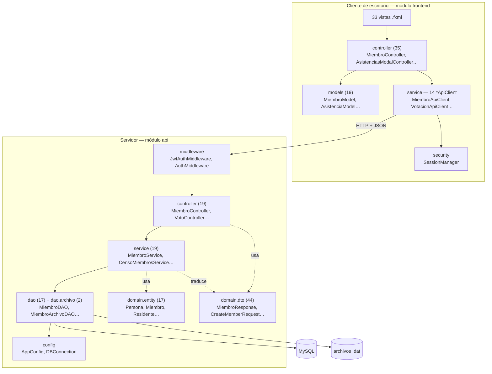
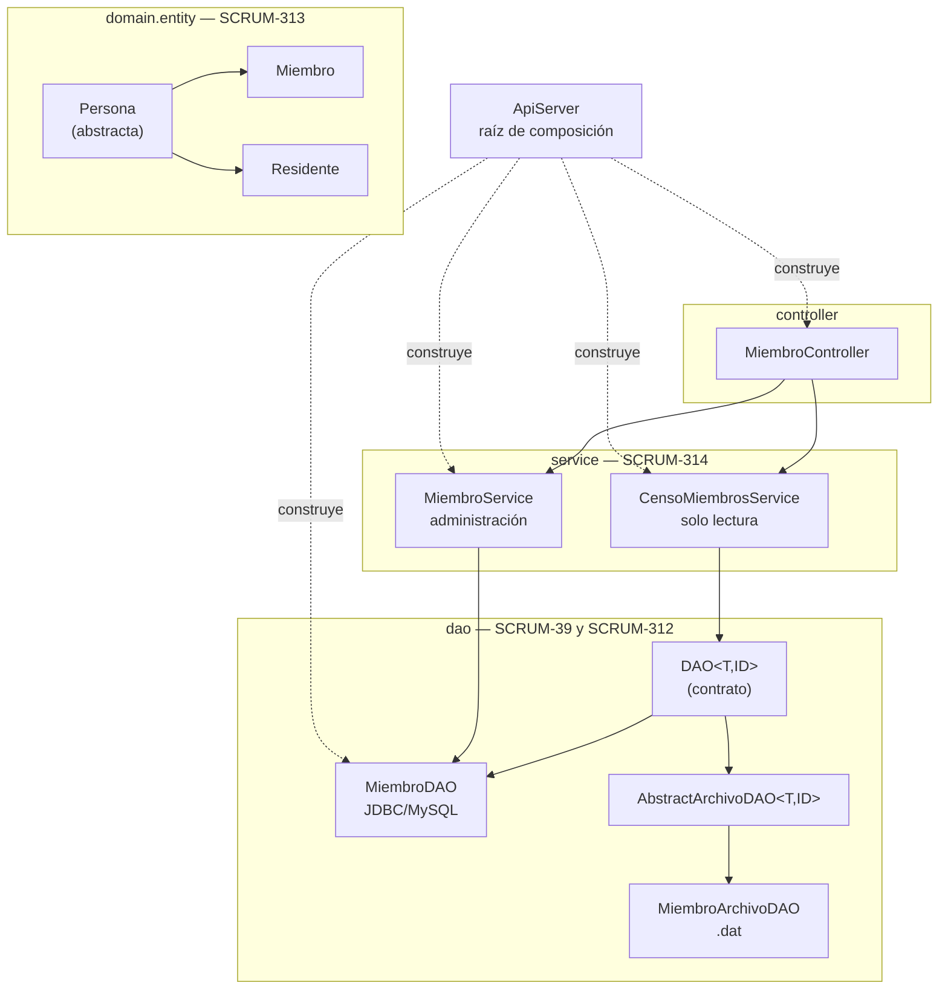

# Arquitectura por capas — evidencia en el código

> **Avance 2 de Programación II · Criterio 8 (1.20 pts) · SCRUM-318**
> Evidencia tomada de la rama `isolated/advance2-compliance-and-fixes`.
> Este documento describe **la arquitectura que existe**, con los nombres de paquete reales del proyecto.
> **No se modificó ninguna clase Java ni se movió ningún paquete para producir esta evidencia.**

---

## Inventario real de paquetes

Conteo de clases por paquete, medido sobre el código actual.

### Módulo `api` — servidor Javalin

| Paquete real | Clases | Responsabilidad | Capa |
|---|---:|---|---|
| `sv.asociacion` | 1 | `ApiServer` — arranque y construcción de dependencias | Composición |
| `sv.asociacion.controller` | 19 | Traducir HTTP ↔ objetos; elegir el código de estado | Control |
| `sv.asociacion.service` | 19 | Reglas de negocio y orquestación | Negocio |
| `sv.asociacion.dao` | 17 | Acceso a MySQL vía JDBC | Datos |
| `sv.asociacion.dao.archivo` | 2 | Acceso a archivos `.dat` (Avance 2) | Datos |
| `sv.asociacion.domain.entity` | 17 | Objetos del dominio; espejo de las tablas | Dominio |
| `sv.asociacion.domain.dto` | 44 | Contratos de entrada y salida de la API | Frontera |
| `sv.asociacion.api.auth` | 16 | Autenticación, sesiones, hash de contraseñas | Transversal |
| `sv.asociacion.middleware` | 2 | Interceptores de autenticación | Transversal |
| `sv.asociacion.config` | 3 | `AppConfig`, `DBConnection`, `DatabaseInitializer` | Infraestructura |
| `sv.asociacion.util` | 2 | `DateUtils`, `PasswordHasher` | Utilidad |

### Módulo `frontend` — cliente JavaFX

| Paquete real | Clases | Responsabilidad | Capa |
|---|---:|---|---|
| `app` | 2 | Punto de entrada de la aplicación de escritorio | Arranque |
| `controller` | 35 | Un controlador por vista; manejan eventos de la interfaz | Presentación |
| `service` | 19 | **14 clases `*ApiClient`** + servicios de plataforma | Acceso remoto |
| `models` | 19 | Objetos que la interfaz muestra y enlaza a la tabla | Modelo de vista |
| `security` | 1 | `SessionManager` — token y usuario en sesión | Transversal |
| `services.auth` | 1 | `AuthService` — bloqueo por intentos fallidos | Negocio del cliente |

Más **33 archivos `.fxml`** en `src/main/resources`: la definición declarativa de cada pantalla.

### Sobre la nomenclatura

El proyecto **no usa los nombres académicos** «presentación / control / negocio / datos» como nombres de paquete. Usa los nombres que la comunidad Java emplea de hecho, y la correspondencia es directa:

- Lo que la rúbrica llama **presentación** es `frontend/controller` + los `.fxml`.
- Lo que llama **control** es `api/controller` — y el nombre coincide, aunque hay dos paquetes llamados `controller` en el proyecto que hacen cosas distintas. Es la única ambigüedad de nombres y conviene aclararla antes de la defensa: **`frontend.controller` maneja clics; `sv.asociacion.controller` maneja peticiones HTTP.**
- Lo que llama **negocio** es `service`.
- Lo que llama **datos** es `dao` (+ `dao.archivo`).
- **Model** de la rúbrica aparece dos veces, en dos lados de la red: `models` en el cliente y `domain.entity` en el servidor. **No son la misma clase y es deliberado** (ver §5).

---

## Diagrama general de capas



**Lo que el diagrama dice y conviene saber leer:** las flechas sólidas son dependencias de llamada y **todas apuntan hacia abajo**. No hay ninguna flecha que suba. Las punteadas son uso de tipos de datos, no llamadas.

---

## Reglas de dependencia

### Quién puede depender de quién

| Capa | Puede llamar a | Nunca debe llamar a |
|---|---|---|
| `frontend/controller` | `service` (*ApiClient*), `models`, `security` | Nada del módulo `api`; nada de JDBC |
| `*ApiClient` | HTTP; `security.SessionManager` para el token | La base de datos |
| `middleware` | `service.AuthService` | Los DAO del dominio |
| `api/controller` | `service`, `domain.dto` | **`dao` directamente** |
| `service` | `dao`, `domain.entity`, `domain.dto` | `controller`; nada de HTTP (`Context`) |
| `dao` | `config.DBConnection`, `domain.entity` | `service`, `controller`, `domain.dto` |
| `domain.entity` | Nada del proyecto | Todo lo demás |

### Verificación de esas reglas sobre el código

No es una declaración de intenciones: se comprobó con `grep`.

| Regla | Comando | Resultado |
|---|---|---|
| El frontend no toca la base de datos | `grep -rl "java.sql\|DBConnection\|DriverManager" frontend/src/main/java` | **0 archivos** ✅ |
| Los DAO no conocen los servicios | `grep -rn "import sv.asociacion.service" .../dao/` | **0 ocurrencias** ✅ |
| Las entidades no conocen DTO ni DAO | `grep -rn "import ...dto\|import ...dao" .../domain/entity/` | **0 ocurrencias** ✅ |
| Los controladores HTTP no importan DAO | `grep -rn "import sv.asociacion.dao" .../controller/` | **1 ocurrencia** ⚠️ — ver Hallazgo 5 |

**18 de los 19 controladores cumplen la regla.** La excepción está documentada como hallazgo, no disimulada.

### Por qué cada regla existe

**Por qué el frontend no accede directamente a la base de datos.** Tres razones concretas de este proyecto, no teóricas:

1. **Las credenciales no viajan.** `DBConnection` lee `DB_USER` y `DB_PASSWORD` (líneas 16-17). Si el cliente se conectara a MySQL, esas credenciales tendrían que estar instaladas en la computadora de cada miembro de la directiva. Al pasar por la API, la única credencial que el cliente conoce es su propio token JWT, que caduca en 15 minutos (`AUTH_ACCESS_TTL_MINUTES`, `AuthService:26`).
2. **Las reglas se aplican en un solo sitio.** La regla «solo los miembros ACTIVOS pueden votar» vive en `VotoService:52`. Si el cliente escribiera directo en `voto`, esa regla habría que repetirla en el cliente de escritorio **y** en el cliente Android — y mantener las dos sincronizadas.
3. **Hay tres clientes.** Escritorio JavaFX, Android y las herramientas de actualización. Los tres hablan el mismo HTTP contra el mismo servidor. Multiplicar el acceso a datos por tres sería multiplicar por tres los errores.

**Por qué los controladores no contienen lógica de negocio.** `MiembroController` (el del servidor) tiene **65 líneas** y hace exactamente tres cosas por método: leer el cuerpo o el parámetro de ruta, llamar al servicio, y traducir el resultado o la excepción a un código HTTP.

```java
public void changeState(Context context) {                                    // línea 56
    try {
        int id = context.pathParamAsClass("id", Integer.class).get();
        var response = miembroService.changeState(id,
            context.bodyAsClass(MemberStateRequest.class).estado());
        if (response == null) context.status(HttpStatus.NOT_FOUND).json(Map.of("error", "Miembro no encontrado."));
        else context.json(response);
    } catch (IllegalArgumentException e) {
        context.status(HttpStatus.BAD_REQUEST).json(Map.of("error", e.getMessage()));
    }
}
```

**No hay una sola decisión de negocio aquí.** La traducción excepción → código HTTP es una decisión de protocolo, y es justo lo que le corresponde a esta capa: `IllegalArgumentException` → 400, `IllegalStateException` → 409 (`create`, líneas 36-40). El servicio lanza excepciones de Java; el controlador las convierte al idioma de HTTP. **Si mañana esta misma lógica se expusiera por otro protocolo, el servicio no cambiaría.**

**Por qué los DAO encapsulan la persistencia.** Ni un solo `String` de SQL sale del paquete `dao`. `MiembroService` no sabe que existe una tabla llamada `miembro`; solo sabe que hay un `MiembroDAO` con métodos. Eso es lo que permite el caso de §4: sustituir MySQL por un archivo `.dat` sin tocar la capa de servicio.

---

## 1. Recorrido de lectura — consultar el padrón de miembros

Recorrido completo, con clases y líneas reales. Es la evidencia principal de SCRUM-314 vista desde la arquitectura.

```mermaid
sequenceDiagram
    participant U as Secretario
    participant FXC as frontend/controller<br/>MiembroController
    participant CLI as frontend/service<br/>MiembroApiClient
    participant MW as middleware<br/>JwtAuthMiddleware
    participant CTL as api/controller<br/>MiembroController
    participant SRV as service<br/>CensoMiembrosService
    participant DAO as DAO&lt;Miembro,Integer&gt;
    participant DB as MySQL

    U->>FXC: abre el módulo de miembros
    FXC->>FXC: cargarMiembros() — Task en hilo aparte
    FXC->>CLI: findAll()
    CLI->>MW: GET /api/miembros + Bearer
    MW->>MW: validateToken()
    MW->>CTL: getAll(ctx)
    CTL->>SRV: censo.findAll()
    SRV->>DAO: origen.findAll()
    DAO->>DB: SELECT * FROM miembro
    DB-->>DAO: ResultSet
    DAO-->>SRV: List&lt;Miembro&gt;
    SRV-->>CTL: List&lt;MiembroResponse&gt;
    CTL-->>CLI: 200 + JSON
    CLI-->>FXC: List&lt;MiembroModel&gt;
    FXC->>U: setOnSucceeded → la tabla se repinta
```

### Paso a paso, con el código

**1. Presentación** — `frontend/src/main/java/controller/MiembroController.java:375`
```java
private void cargarMiembros() {
    lblEstadoModulo.setText("Conectando al servidor...");
    Task<List<MiembroModel>> task = new Task<>() {
        @Override protected List<MiembroModel> call() throws Exception {
            return new MiembroApiClient().findAll();
        }
    };
    task.setOnSucceeded(event -> { miembros.setAll(task.getValue()); ... });   // línea 383
    Thread thread = new Thread(task, "cargar-miembros-api");                    // línea 399
    thread.setDaemon(true); thread.start();
}
```
Trabaja con `MiembroModel`, no con `Miembro`. **No conoce el módulo `api`.**

**2. Acceso remoto** — `frontend/src/main/java/service/MiembroApiClient.java:29`
```java
public List<MiembroModel> findAll() throws IOException, InterruptedException {
    HttpResponse<String> response = send(request("/api/miembros").GET().build());
    ensure(response, 200);
    return Arrays.stream(json.readValue(response.body(), MiembroResponse[].class))
        .map(MiembroResponse::toModel).toList();
}
```
Es la **única capa del cliente que sabe que existe HTTP**. El `request(...)` adjunta el token desde `SessionManager.requireToken()`. Traduce el DTO recibido a `MiembroModel` en la misma línea: la interfaz nunca ve un DTO crudo.

**3. Transversal** — `middleware/JwtAuthMiddleware.java:15`, registrado en `ApiServer:95`
```java
cfg.routes.before("/api/*", jwtAuth::authenticate);
```
Se ejecuta **antes de todas** las rutas `/api/*`. Si el token no vale, corta ahí mismo con 401 y `skipRemainingHandlers()` (líneas 31-37). Si vale, deja el usuario en el contexto (`context.attribute("idUsuario", ...)`, línea 38) para quien lo necesite después. **Ningún controlador repite esa comprobación.**

**4. Control** — `api/src/main/java/sv/asociacion/controller/MiembroController.java:21`
```java
public void getAll(Context context) {
    context.json(censo.findAll());
}
```
Una línea. No hay nada que decidir en una lectura sin filtros.

**5. Negocio** — `service/CensoMiembrosService.java:35`
```java
private final DAO<Miembro, Integer> origen;                       // línea 28

public List<MiembroResponse> findAll() {
    return origen.findAll().stream().map(MiembroResponse::from).toList();
}
```
**El campo se declara como el contrato `DAO<Miembro,Integer>`, no como `MiembroDAO`.** Aquí ocurre la traducción entidad → DTO: el servicio decide qué sale hacia afuera.

**6. Datos** — `dao/MiembroDAO.java:28`
```java
@Override
public List<Miembro> findAll() {
    List<Miembro> miembros = new ArrayList<>();
    String sql = "SELECT * FROM miembro";
    try (Connection conn = DBConnection.getInstance().getConnection(); ...) {
        while (rs.next()) miembros.add(mapResultSet(rs));
    }
    return miembros;
}
```
El SQL termina aquí. La conexión viene de `config.DBConnection`, no se construye a mano.

### Dónde entra `MiembroArchivoDAO`

En el paso 6, y **en ningún otro sitio**. `CensoMiembrosService` recibe un `DAO<Miembro,Integer>`; que detrás haya MySQL o un archivo lo decide quien lo construye:

```java
// ApiServer.java:45 — lo que corre hoy en producción
CensoMiembrosService censoMiembros = new CensoMiembrosService(miembroDAO);

// CensoMiembrosServiceTest.java:110 — la otra implementación del mismo contrato
DAO<Miembro, Integer> archivo = new MiembroArchivoDAO(carpeta.resolve("miembros.dat"));
```

**Los pasos 1 a 5 no cambian ni una línea.** Esa es la prueba de que la separación de capas no es decorativa: si lo fuera, cambiar el origen de datos obligaría a tocar el servicio. La prueba `ambasRamasProducenElMismoResultado` (`CensoMiembrosServiceTest:171`) lo verifica de forma automática.

---

## 2. Recorrido de escritura — dar de baja a un miembro

`PATCH /api/miembros/{id}/estado`. Se eligió este caso porque **la regla y la transacción están cada una en su capa**, y se ve dónde.

```
Secretario
  │  confirma el diálogo
  ▼
frontend/controller/MiembroController.cambiarEstado()            :205-228
  │  Task<MiembroModel> en hilo "cambiar-estado-miembro-api"
  ▼
frontend/service/MiembroApiClient.changeState(id, estado)        :59-61
  │  PATCH /api/miembros/{id}/estado   body: {"estado":"INACTIVO"}
  ▼
middleware/JwtAuthMiddleware.authenticate()                      :15
  │  valida el token · deja idUsuario en el contexto
  ▼
api/controller/MiembroController.changeState(ctx)                :56-65
  │  lee el path param y MemberStateRequest · traduce errores a HTTP
  ▼
service/MiembroService.changeState(id, state)                    :63-72
  │  ◀── REGLA DE NEGOCIO: el estado debe ser ACTIVO o INACTIVO
  ▼
dao/MiembroDAO.changeEstado(id, estado)                          :131-158
  │  ◀── TRANSACCIÓN: miembro + usuario, o ninguno de los dos
  ▼
MySQL  ·  UPDATE miembro  +  UPDATE usuario
  │
  ▼
after("/api/*")  →  BitacoraService.registrar(...)               ApiServer:196-212
```

### Dónde está la regla de negocio — `MiembroService.java:63`

```java
public MiembroResponse changeState(int id, String state) {
    Miembro.Estado estado;
    try {
        estado = Miembro.Estado.valueOf(state == null ? "" : state.trim().toUpperCase());
    } catch (IllegalArgumentException exception) {
        throw new IllegalArgumentException("El estado debe ser ACTIVO o INACTIVO.");
    }
    if (!miembroDAO.changeEstado(id, estado)) return null;
    return miembroDAO.findById(id).map(MiembroResponse::from).orElse(null);
}
```

El servicio convierte un texto arbitrario que llegó por la red en un valor del `enum` **antes de que llegue a la base**, y produce un mensaje que una persona entiende. El controlador no sabe qué estados existen; el DAO recibe un `Miembro.Estado` ya válido y no tiene que validarlo.

### Dónde está la transacción — `MiembroDAO.java:131`

```java
public boolean changeEstado(Integer id, Miembro.Estado estado) {
    String memberSql = "UPDATE miembro SET estado = ? WHERE id_miembro = ?";
    String userSql   = "UPDATE usuario SET estado = ? WHERE id_miembro = ?";
    try (Connection conn = DBConnection.getInstance().getConnection()) {
        conn.setAutoCommit(false);
        try (PreparedStatement member = conn.prepareStatement(memberSql);
             PreparedStatement user   = conn.prepareStatement(userSql)) {
            ...
            boolean changed = member.executeUpdate() > 0;
            if (!changed) { conn.rollback(); return false; }
            user.executeUpdate();
            conn.commit();
            return true;
        } catch (SQLException exception) {
            conn.rollback();
            throw exception;
        } finally {
            conn.setAutoCommit(true);
        }
    } catch (SQLException e) {
        throw new IllegalStateException("No fue posible cambiar el estado del miembro.", e);
    }
}
```

**Este es el punto más importante del documento para la defensa.**

Dar de baja a un miembro toca **dos tablas**: `miembro` y `usuario`. Si solo se actualizara la primera, quedaría alguien inactivo en el padrón pero con la cuenta todavía habilitada para entrar al sistema. `setAutoCommit(false)` … `commit()` / `rollback()` hace que las dos actualizaciones sean **una sola operación indivisible**.

Y la transacción está **en el DAO, no en el servicio**, porque es donde vive la `Connection`. Sacarla al servicio obligaría a que el servicio manejara conexiones JDBC — es decir, a que la capa de negocio conociera la tecnología de persistencia. Justo lo que las capas existen para evitar.

> **Esta transacción es la razón técnica por la que `CensoMiembrosService` es un servicio aparte y de solo lectura.** `changeEstado` no tiene equivalente en un archivo `.dat`: no hay transacción entre dos archivos. Por eso las escrituras siguen atadas a `MiembroDAO` y solo las lecturas pasan por el contrato genérico. Está documentado en `CensoMiembrosService` líneas 12-15.

### La capa transversal: bitácora — `ApiServer.java:196`

```java
cfg.routes.after("/api/*", ctx -> {
    int status = ctx.status().getCode();
    if (status >= 200 && status < 300) {
        String method = ctx.method().name();
        String path = ctx.path();
        if (path.startsWith("/api/bitacoras")) return;
        if (method.equals("POST") || method.equals("PUT") || method.equals("PATCH") || method.equals("DELETE")) {
            Integer idUsuario = ctx.attribute("idUsuario");
            bitacoraService.registrar(idUsuario, accion, entidad, idRegistro, method + " " + path);
        }
    }
});
```

Se ejecuta **después** de cada ruta `/api/*`. Registra solo lo que modifica datos y solo si la operación salió bien (2xx). El `idUsuario` lo dejó el middleware en el paso 3.

**Por qué esto es arquitectura y no un detalle:** ningún controlador ni servicio contiene una línea de auditoría. Si la bitácora se hubiera escrito dentro de cada método de escritura, serían ~40 puntos que mantener sincronizados y donde alguien olvidaría uno. Aquí es **un solo lugar**, y la exclusión de `/api/bitacoras` evita que consultar la bitácora genere entradas de bitácora.

El manejador de excepciones (`ApiServer:225`) es la otra pieza transversal: convierte cualquier excepción no capturada en un 500 con un mensaje genérico, **sin filtrar detalles internos al cliente**.

---

## 3. `ApiServer` como raíz de composición

`api/src/main/java/sv/asociacion/ApiServer.java`, líneas 22-84

```java
public static void main(String[] args) {
    AppConfig config = AppConfig.load();

    MiembroDAO miembroDAO = new MiembroDAO();          // 1. los DAO
    ...
    MiembroService miembroService = new MiembroService(miembroDAO, new MemberProvisioningService());
    CensoMiembrosService censoMiembros = new CensoMiembrosService(miembroDAO);   // 2. los servicios
    ...
    MiembroController miembros = new MiembroController(miembroService, censoMiembros);  // 3. los controladores
    ...
}
```

**Sí corresponde llamarlo raíz de composición**, y es una afirmación verificable, no una etiqueta: es el **único** punto del módulo `api` donde se construyen las dependencias, y el orden del método `main` es literalmente de abajo hacia arriba — primero los DAO, luego los servicios que los reciben, luego los controladores que reciben los servicios.

**Lo que NO es, y conviene decirlo para no sobrevender:**

- **No es un Service Locator.** Nadie le pide una dependencia a `ApiServer`. No tiene métodos estáticos de búsqueda; su constructor es privado (línea 20) y solo expone `main`. Las dependencias se **entregan** por constructor hacia abajo, no se **piden** hacia arriba.
- **No es un contenedor de inyección.** No hay anotaciones, ni reflexión, ni un framework resolviendo el grafo. Son llamadas a `new` en el orden correcto, escritas a mano. Para un proyecto de este tamaño eso es una ventaja: el grafo completo de dependencias se lee en 60 líneas.

Existe además `DAOFactory` (`dao/DAOFactory.java`) con métodos `getMiembroDAO()` etc., pero **`ApiServer` no lo usa**: construye los DAO directamente. Se menciona por honestidad; no forma parte del flujo activo.

---

## 4. Dónde encajan los cambios del Avance 2

Ninguno de los cinco cambios introdujo una capa nueva ni movió responsabilidades. Cada uno entró en la capa que ya le correspondía.



| Cambio | Ticket | Capa donde entró | Por qué no rompe nada |
|---|---|---|---|
| `Persona` abstracta, `Miembro` y `Residente` | SCRUM-313 | `domain.entity` | Solo añade una clase base. Las entidades siguen sin importar nada del proyecto. |
| `AbstractArchivoDAO<T,ID>` | SCRUM-39 | `dao.archivo` | Implementa el contrato `DAO<T,ID>` que ya existía. No añade métodos al contrato. |
| `MiembroArchivoDAO` | SCRUM-312 | `dao.archivo` | Es un DAO más: al mismo nivel que `MiembroDAO`, cumpliendo el mismo contrato. |
| `CensoMiembrosService` | SCRUM-314 | `service` | Depende del contrato, no de la implementación. No toca `MiembroService`. |
| `MiembroController` recibe el nuevo servicio | SCRUM-314 | `controller` | El constructor pasó de 1 a 2 parámetros; ninguna lógica entró al controlador. |

La prueba de que ninguno rompió la arquitectura es medible: la línea base de pruebas pasó de 144/143 a **189/188**, y el único error sigue siendo el mismo fallo ambiental de antes.

### El lugar de la persistencia `.dat`

Conviene ser preciso, porque es lo más fácil de exagerar en una defensa.

```
                       ┌─────────────────────────┐
      service ────────▶│   DAO<Miembro,Integer>  │   el contrato
                       └────────────┬────────────┘
                                    │
                    ┌───────────────┴───────────────┐
                    ▼                               ▼
          ┌──────────────────┐          ┌────────────────────────┐
          │   MiembroDAO     │          │  MiembroArchivoDAO     │
          │   JDBC / MySQL   │          │  extends AbstractArchivoDAO
          └────────┬─────────┘          └───────────┬────────────┘
                   ▼                                ▼
              ┌─────────┐                   ┌──────────────┐
              │  MySQL  │                   │ miembros.dat │
              └─────────┘                   └──────────────┘
             ACTIVO en producción          ACTIVO en pruebas
             (ApiServer:45)                (CensoMiembrosServiceTest)
```

**Las tres cosas que hay que decir, y en este orden:**

1. **Ocupa exactamente el mismo lugar que `MiembroDAO`**: la capa de datos, implementando el mismo contrato. No es una capa nueva ni un caché por encima.
2. **Es un origen de datos autónomo.** Lo que se guarda en `miembros.dat` se recupera de ahí. `MiembroArchivoDAO` **no conoce MySQL, no sincroniza con él y no lo sustituye** — está escrito así en su propio Javadoc, líneas 17-20.
3. **Hoy no está cableado en `ApiServer`.** `ApiServer:45` inyecta la implementación JDBC. La de archivo se ejercita en las pruebas, donde `CensoMiembrosServiceTest` corre la misma lógica contra las dos y comprueba que producen resultados idénticos. **Decir que el sistema «funciona sin conexión» sería falso**; lo cierto y demostrable es que la capa de servicio no depende de cuál de las dos esté conectada.

---

## 5. Entity, DTO y Model: tres objetos, tres razones

Es la pregunta más probable de la defensa —«¿por qué tres clases para un miembro?»— y tiene respuesta concreta.

| Objeto | Paquete | Para qué existe | Qué pasaría si no |
|---|---|---|---|
| `Miembro` | `api` · `domain.entity` | Espejo de la tabla. Tipos de Java: `LocalDate`, `enum Estado`. | — |
| `MiembroResponse` | `api` · `domain.dto` | Contrato de la API. Todo texto: fechas y estado como `String`. | — |
| `MiembroModel` | `frontend` · `models` | Lo que la tabla de JavaFX muestra. | — |

```java
// domain/dto/MiembroResponse.java:10
public static MiembroResponse from(Miembro miembro) {
    return new MiembroResponse(
        miembro.getIdMiembro(), miembro.getDui(), ...,
        miembro.getFechaIngreso() == null ? null : miembro.getFechaIngreso().toString(),
        miembro.getEstado()      == null ? null : miembro.getEstado().name()
    );
}
```

**Qué protege esta separación, en concreto:**

- **Cambiar la tabla no rompe a los clientes.** Si mañana `miembro` gana una columna interna, `Miembro` la tiene y `MiembroResponse` no. La API no cambia y los tres clientes siguen funcionando.
- **Lo que no debe salir, no sale.** `Usuario` tiene `claveHash`; su DTO no lo lleva. Si la API devolviera entidades, publicaría hashes de contraseña.
- **El formato de red se decide una vez.** La conversión `LocalDate → String` está en `MiembroResponse.from`, no repartida por los controladores.
- **`MiembroModel` existe porque JavaFX tiene sus propias necesidades** —propiedades observables, texto formateado para la celda— que no tienen nada que ver con el modelo del servidor. `MiembroApiClient:32` hace la traducción `MiembroResponse → MiembroModel` en la frontera, y **el resto del cliente nunca ve un DTO**.

Los 44 DTO frente a 17 entidades no son redundancia: hay `CreateMemberRequest` (lo que entra, con `validationError()` propio), `MiembroResponse` (lo que sale), `MemberStateRequest`, `CreateMemberResponse`… Cada operación declara exactamente qué acepta y qué devuelve.

---

## Desviaciones detectadas — se registran, no se corrigen aquí

Al verificar las reglas de dependencia aparecieron dos puntos. **No se ha modificado nada.** Se proponen para **SCRUM-311**.

### Hallazgo 5 — `VotoController` depende directamente de `UsuarioDAO`

`api/src/main/java/sv/asociacion/controller/VotoController.java`

```java
import sv.asociacion.dao.UsuarioDAO;                    // línea 6
private final UsuarioDAO usuarioDAO;                    // línea 15

// en emitir(), línea 32:
if (idUsuario != null && usuarioDAO != null) {
    idMiembroSesion = usuarioDAO.findById(idUsuario).map(Usuario::getIdMiembro).orElse(null);
}
// y otra vez en verificarParticipacion(), línea 61
```

**Es la única violación de la regla «los controladores no llaman a los DAO» en todo el proyecto** — 18 de 19 controladores la cumplen. El controlador salta la capa de servicio para traducir *idUsuario de sesión → idMiembro*, y esa traducción se repite en dos métodos.

Además el campo es **opcional** (`VotoController(service)` en la línea 17 lo deja en `null`), lo que obliga a comprobar `usuarioDAO != null` en cada uso y significa que, según cómo se construya, la deducción del miembro simplemente no ocurre.

La corrección natural sería mover esa traducción a `VotoService` o a un método del servicio de autenticación, y dejar el controlador recibiendo solo servicios.

**No se corrige aquí** porque SCRUM-318 es exclusivamente documental y esto es un cambio funcional que necesita su propia prueba.

### Hallazgo 6 — Dependencia oculta en el constructor de conveniencia de `RolService`

`api/src/main/java/sv/asociacion/service/RolService.java`, línea 21

```java
public RolService(RolDAO rolDAO) {
    this(rolDAO, new UsuarioDAO());     // ← construye su propia dependencia
}
```

El servicio crea un `UsuarioDAO` por su cuenta en lugar de recibirlo. Eso contradice el patrón del resto del proyecto, donde `ApiServer` es el único que decide qué implementación se usa, y hace que ese constructor sea imposible de probar con un DAO en memoria.

**Impacto real hoy: bajo.** `ApiServer:49` usa el constructor completo de dos parámetros, así que el camino de producción no pasa por ahí. Es una puerta abierta, no un problema activo.

Es el **único** `new ...DAO()` dentro de `service/` o `controller/` en todo el módulo `api`.

---

## Cómo demostrar la arquitectura durante la defensa

Tres archivos, en este orden. El orden importa: va de lo más visible a lo más técnico, y cada paso responde la pregunta que el anterior provoca.

**1 — La raíz de composición: `ApiServer.java:22-84`**
Abrir `main()` y **desplazarse despacio**. Se ve el orden: primero los 15 DAO, luego los servicios que los reciben por constructor, luego los controladores que reciben los servicios, luego las rutas. *«Todo el grafo de dependencias del sistema está en estas 60 líneas, y se lee de abajo hacia arriba.»*
Señalar la línea 95 —`before("/api/*", jwtAuth::authenticate)`— y la 196 —`after("/api/*", ...)` de bitácora—: la autenticación y la auditoría son transversales y están **cada una en un solo sitio**, no repetidas en 40 métodos.

**2 — Una petición completa: los tres `MiembroController`… que son dos**
Abrir en pestañas `frontend/controller/MiembroController.java:375` y `api/controller/MiembroController.java:21`, uno al lado del otro.
- El de la izquierda llama a `new MiembroApiClient().findAll()` y trabaja con `MiembroModel`. **No importa nada del módulo `api`.**
- El de la derecha tiene **65 líneas** y su `getAll` es **una sola línea**: `context.json(censo.findAll())`.
- La frase que cierra el punto: *«El cliente no sabe que existe MySQL; el servidor no sabe que existe JavaFX. Lo único que comparten es el JSON.»*
Si piden la prueba de que el cliente no toca la base: `grep -rl "java.sql\|DBConnection" frontend/src/main/java` devuelve **cero archivos**. Se puede ejecutar en vivo.

**3 — Dónde vive cada responsabilidad: `MiembroService.java:63` → `MiembroDAO.java:131`**
Es el punto más fuerte y conviene reservarlo para el final.
- En el **servicio**: convertir `"inactivo"` en `Miembro.Estado.INACTIVO` y lanzar *«El estado debe ser ACTIVO o INACTIVO»*. Eso es la **regla**.
- En el **DAO**: `setAutoCommit(false)`, dos `UPDATE` —`miembro` y `usuario`—, `commit()` o `rollback()`. Eso es la **transacción**.
- La explicación: *«Dar de baja a un miembro toca dos tablas. Si solo se actualizara una, quedaría alguien inactivo en el padrón pero con la cuenta todavía habilitada para entrar. La transacción está en el DAO porque es donde vive la `Connection`; subirla al servicio obligaría a la capa de negocio a manejar JDBC.»*

**Si preguntan por el archivo `.dat`:** `CensoMiembrosService.java:28` — el campo declarado como `DAO<Miembro,Integer>`. Decir las tres cosas de §4 en orden, incluida la tercera: **en producción está cableada la implementación JDBC**; la de archivo se ejercita en las pruebas, y la prueba `ambasRamasProducenElMismoResultado` comprueba que las dos dan el mismo resultado. Es más sólido que insinuar que el sistema funciona sin conexión.

**Si preguntan por qué tres clases para un miembro:** `Usuario` tiene `claveHash` y su DTO no lo lleva. Un ejemplo concreto vale más que la explicación general.

---

## Nota de alcance

**No se modificó ningún archivo `.java` ni se movió ningún paquete para producir este documento.** La arquitectura descrita es la que existe en la rama; las dos desviaciones encontradas se documentan sin corregir y pertenecen a SCRUM-311. Los diagramas Mermaid referencian únicamente clases reales del proyecto, con su paquete y su línea.
